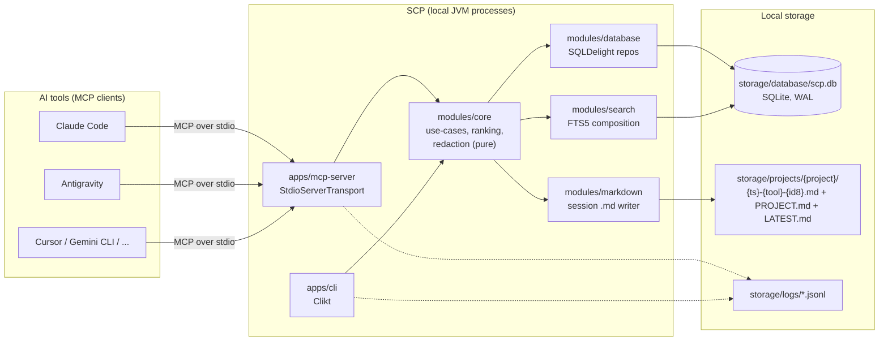
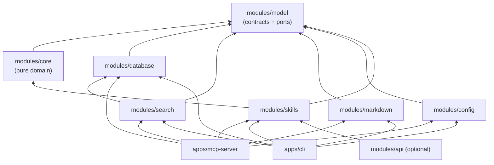

# SCP Architecture

> Phase 1 deliverable. Companion documents: [technology decisions](02-technology-decisions.md), [database schema](03-database-schema.md), [session resolution](04-session-resolution.md), [hydration ranking](05-hydration-ranking.md).

## 1. System overview

SCP is a **local-first persistent context layer** that MCP-compatible AI tools talk to over stdio. It is not an AI: it stores, indexes, ranks, and returns project context. All state lives in local files — one SQLite database (WAL mode) plus human-readable Markdown mirrors.



Each AI tool launches its own `mcp-server` process over stdio (the normal MCP invocation model), so **multiple SCP processes may access the same SQLite file concurrently**. WAL mode, `BEGIN IMMEDIATE` write transactions, and busy-retry make that safe — see [session resolution & concurrency](04-session-resolution.md).

## 2. Clean Architecture layering

| Layer | Modules | Responsibility | Allowed dependencies |
|---|---|---|---|
| **Domain** | `modules/core` | Use-cases (UpdateContext, HydrateContext, …), ranking function, secret redaction, session resolution policy. **Zero I/O.** | `model` only |
| **Contracts** | `modules/model` | `@Serializable` data classes, `ContextType` enum, MCP tool schemas, **all port interfaces** (repositories, `MarkdownStore`, `Clock`, `IdGenerator`, `TransactionRunner`) | kotlinx.serialization, kotlinx.datetime only |
| **Adapters** | `modules/database`, `modules/search`, `modules/markdown`, `modules/config` | Implement the ports: SQLDelight repositories, FTS5 query composition, `.md` file generation, kaml config loading | `model` (+ their own runtime libs) |
| **Orchestration** | `modules/skills` | Thin skill entry points (`UpdateContext.kt`, `HydrateContext.kt`, …) that call `core` use-cases — no business logic of their own | `core`, `model` |
| **Delivery / composition roots** | `apps/mcp-server`, `apps/cli`, (`modules/api` optional) | Wire concrete adapters into use-cases via constructor injection; translate MCP/CLI/HTTP requests to use-case calls | everything |

The boundary rule is **enforced by the Gradle module graph**, not convention: `modules/core/build.gradle.kts` declares a dependency on `modules/model` and nothing else, so an accidental `import com.scp.database.*` in `core` is a compile error.

### Module dependency graph



Notes:

- `search → database` is allowed: the search adapter consumes SQLDelight-generated typed queries from `database` rather than duplicating schema knowledge. `core` still only sees the `SearchIndex` port.
- `apps/*` are the **only** places where concrete classes meet interfaces (composition roots). Manual constructor injection — no DI framework (see [ADR-12](02-technology-decisions.md#adr-12--manual-constructor-di-no-di-framework)).

## 3. Ports (interfaces in `modules/model`)

All I/O crosses one of these interfaces. `core` depends on nothing else.

| Port | Implemented by | Purpose |
|---|---|---|
| `ProjectRepository` | `database` | CRUD for projects |
| `SessionRepository` | `database` | Session CRUD + `findOpenSessions(projectId)` + atomic resolve-or-create |
| `ContextEntryRepository` | `database` | Entry CRUD + tag join-table maintenance |
| `DecisionRepository` | `database` | Decision CRUD + `findOpenByProject` |
| `TodoRepository` | `database` | Todo CRUD + `findOpenByProject` |
| `FileRepository` | `database` | Tracked-file CRUD + `findRecentlyModified` |
| `SearchIndex` | `search` | Composable full-text + structured-filter queries |
| `MarkdownStore` | `markdown` | Write/read one `.md` per session |
| `TransactionRunner` | `database` | `fun <T> inWriteTransaction(block: () -> T): T` — `BEGIN IMMEDIATE`, busy-retry, per-file mutex |
| `Clock` | apps (system impl) | `now(): Instant` — injectable for deterministic tests |
| `IdGenerator` | apps (UUID v4 impl) | `newId(): String` — injectable for deterministic tests |

## 4. Folder structure (Gradle multi-module)

```
scp/
  settings.gradle.kts
  build.gradle.kts                 # root: ktlint/detekt conventions, no code
  gradle/
    libs.versions.toml             # single source of dependency versions
  apps/
    mcp-server/                    # StdioServerTransport wiring, tool registration
      src/main/kotlin/
      src/test/kotlin/
    cli/                           # Clikt: scp init|update|hydrate|search|summary|timeline|doctor
      src/main/kotlin/
      src/test/kotlin/
  modules/
    model/                         # @Serializable DTOs, ContextType, port interfaces, MCP tool schemas
    core/                          # use-cases, scoreEntry(), redactSecrets(), session policy — zero I/O
    database/                      # SQLDelight .sq/.sqm, repository implementations, TransactionRunner
      src/main/sqldelight/com/scp/database/
    search/                        # FTS5 query composition over generated queries
    markdown/                      # session .md generation/parsing
    config/                        # kaml loader + fail-fast validation
    skills/                        # UpdateContext.kt, HydrateContext.kt, SearchContext.kt,
                                   # SummarizeContext.kt, Timeline.kt — thin orchestration only
    api/                           # optional Ktor local HTTP surface (not built in v1)
  storage/                         # runtime data (gitignored), created on `scp init`
    projects/{project}/            # the markdown mirror: project-first, then date-first
      PROJECT.md                   #   index — resume point + every session, newest first
      LATEST.md                    #   copy of the newest session (the resume anchor)
      {YYYY-MM-DD}T{HH-mm-ss}Z-{tool}-{id8}.md
    database/scp.db
    logs/scp-YYYY-MM-DD.jsonl      # always under this baseDir, never the working directory
  docs/
  config.yaml
```

**Deviation from the original spec, flagged:** the spec placed `skills/` at the repo root as loose `.kt` files. Loose Kotlin files outside a Gradle module cannot compile or be tested, so skills live in a proper module `modules/skills` (same content, same thin-orchestration role). See [ADR-15](02-technology-decisions.md#adr-15--skills-as-a-gradle-module).

## 5. Request flow (write path)

`update_context` end to end:

1. **MCP boundary** (`apps/mcp-server`): raw JSON → kotlinx.serialization (shape) → Konform (constraints). Invalid input is rejected here; nothing unvalidated crosses inward.
2. **Skill** (`modules/skills/UpdateContext.kt`): translates the validated DTO into a `core` use-case call.
3. **Core** (`UpdateContextUseCase`):
   - resolves the target session ([session resolution](04-session-resolution.md)),
   - runs **secret redaction** (pure function) over every ContextEntry body and file summary **before** anything is handed to a repository,
   - hands redacted entities to repositories inside one `TransactionRunner.inWriteTransaction { }`.
4. **Adapters**: `database` persists rows (FTS5 index updated automatically by triggers); `markdown` writes/updates the session `.md`; the session is closed (`status='closed'`, `end_time` set) unless `keep_open=true`.
5. **Logging**: tool name, project, duration logged as structured JSON.

The read path (`hydrate_context`) is documented in [hydration ranking](05-hydration-ranking.md).

## 6. Extension points (concrete, reserved now)

| Future feature | Reservation made in v1 |
|---|---|
| Embeddings / vector search | `context_entry.embedding BLOB` column exists (nullable, unused). Adding vectors is an `UPDATE`, not a migration. |
| Semantic ranking | `scoreEntry()` takes a `RankingWeights` value object; adding `w5 * semanticSimilarity` extends the weights class and one sum — no interface change. See [ranking spec §6](05-hydration-ranking.md#6-reserved-extension-semantic-similarity). |
| Cloud sync / merge | UUID v4 TEXT PKs (no cross-machine collisions) + ISO 8601 UTC timestamps (total ordering) chosen now specifically so a sync protocol needs no ID migration. |
| Git integration | `file.hash` column + `COMMIT` context type already in schema; a git adapter is a new `model` port + adapter module, touching no existing code. |
| HTTP/SSE transport | Kotlin MCP SDK ships Ktor `mcp { }` extensions; `modules/api` slot reserved. Stdio path unaffected. |
| Multi-user / conflict resolution | Session rows are per-tool by design (never merged), which is the same isolation property a multi-writer merge protocol needs. |
| Kotlin Multiplatform | `core` and `model` are pure Kotlin with zero JVM-only I/O — the natural first modules to move to KMP targets. |

## 7. Performance budget (hydration < 1 s)

Per [ADR-2](02-technology-decisions.md#adr-2--jvm-cold-start-accepted-no-native-image-in-v1): JVM cold start ~150–300 ms is accepted; the remaining ~700 ms budget is allocated ~100 ms config+connection init, ~300 ms queries+ranking (indexed queries over ~500 entries are single-digit ms; ranking 500 candidates is trivial arithmetic), ~100 ms serialization, leaving ≥200 ms headroom. GraalVM native-image is the documented fallback if profiling ever disproves this.
