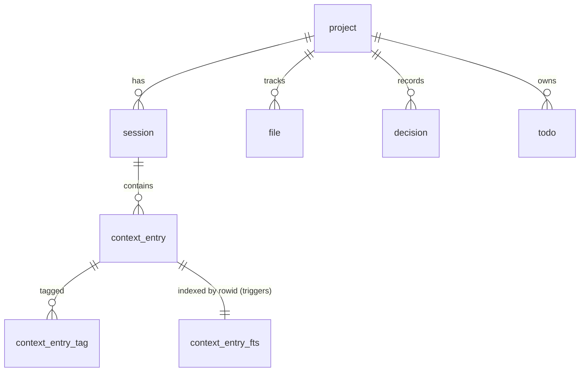

# SCP Database Schema (SQLDelight)

> This document **is** the Phase 2 `.sq` content — the schema below is copied verbatim into `modules/database/src/main/sqldelight/com/scp/database/` when the build is scaffolded. It is not a parallel description that can drift.

Design invariants (see [ADR-4…8](02-technology-decisions.md)):

- All PKs are **UUID v4 stored as lowercase TEXT**.
- All timestamps are **ISO 8601 UTC TEXT** (`kotlinx.datetime.Instant.toString()`), so lexicographic order is chronological order.
- Foreign keys are real: `PRAGMA foreign_keys = ON` at every connection init.
- `context_entry` keeps its **implicit rowid** (never `WITHOUT ROWID`) — the FTS5 external-content table links by rowid.
- Schema evolves only via SQLDelight `.sqm` migrations.

## 1. Connection initialization (every connection, in order)

```sql
PRAGMA journal_mode = WAL;
PRAGMA foreign_keys = ON;
PRAGMA busy_timeout = 5000;
PRAGMA synchronous = NORMAL;
```

## 2. Tables

### Project.sq

```sql
CREATE TABLE project (
    id          TEXT NOT NULL PRIMARY KEY,           -- UUID v4
    name        TEXT NOT NULL UNIQUE,
    description TEXT NOT NULL DEFAULT '',
    created_at  TEXT NOT NULL,                       -- ISO 8601 UTC
    updated_at  TEXT NOT NULL
);
```

### Session.sq

```sql
CREATE TABLE session (
    id          TEXT NOT NULL PRIMARY KEY,           -- UUID v4
    project_id  TEXT NOT NULL REFERENCES project(id),
    tool_name   TEXT NOT NULL,                       -- 'claude-code', 'antigravity', ...
    start_time  TEXT NOT NULL,
    end_time    TEXT,                                -- NULL while open
    summary     TEXT NOT NULL DEFAULT '',
    token_usage INTEGER,                             -- NULL if the tool doesn't report it
    status      TEXT NOT NULL DEFAULT 'open' CHECK (status IN ('open', 'closed'))
);

CREATE INDEX idx_session_project_status ON session(project_id, status);
CREATE INDEX idx_session_start_time     ON session(start_time);
```

`(project_id, status)` is the hot index: session resolution's `WHERE project_id = ? AND status = 'open'` and doctor's stale-session scan both hit it.

### ContextEntry.sq

```sql
CREATE TABLE context_entry (
    id         TEXT NOT NULL PRIMARY KEY,            -- UUID v4
    session_id TEXT NOT NULL REFERENCES session(id),
    timestamp  TEXT NOT NULL,
    title      TEXT NOT NULL,
    content    TEXT NOT NULL,                        -- redacted BEFORE insert (see §5)
    type       TEXT AS ContextType NOT NULL,         -- SQLDelight enum column adapter
    priority   INTEGER NOT NULL DEFAULT 3 CHECK (priority BETWEEN 1 AND 5),
    embedding  BLOB                                  -- reserved: future vectors, unused in v1
);

CREATE INDEX idx_context_entry_session   ON context_entry(session_id);
CREATE INDEX idx_context_entry_timestamp ON context_entry(timestamp);
CREATE INDEX idx_context_entry_type      ON context_entry(type);
```

`type TEXT AS ContextType` binds the single `ContextType` enum from `modules/model` via SQLDelight's `EnumColumnAdapter` — stored as `.name` (e.g. `DECISION`), no duplicated string literals anywhere.

### ContextEntryTag.sq

```sql
CREATE TABLE context_entry_tag (
    entry_id TEXT NOT NULL REFERENCES context_entry(id) ON DELETE CASCADE,
    tag      TEXT NOT NULL,                          -- stored lowercase, trimmed
    PRIMARY KEY (entry_id, tag)
);

CREATE INDEX idx_context_entry_tag_tag ON context_entry_tag(tag);
```

Tags are **only** here — normalized join table, indexed both directions (PK covers entry→tags; `idx_..._tag` covers tag→entries). No JSON blob, no `LIKE` scans. Written in the same transaction as the parent entry.

### File.sq

```sql
CREATE TABLE file (
    id         TEXT NOT NULL PRIMARY KEY,            -- UUID v4
    project_id TEXT NOT NULL REFERENCES project(id),
    path       TEXT NOT NULL,                        -- project-relative, '/' separators
    summary    TEXT NOT NULL DEFAULT '',             -- redacted BEFORE insert (see §5)
    hash       TEXT NOT NULL,                        -- content hash (sha256 hex); git-integration hook
    updated_at TEXT NOT NULL,
    UNIQUE (project_id, path)
);

CREATE INDEX idx_file_project_updated ON file(project_id, updated_at);
```

`updated_at` added beyond the spec's column list: hydration section 7 ("recently modified files") needs an indexed recency ordering; `hash` alone can't provide it.

### Decision.sq

```sql
CREATE TABLE decision (
    id         TEXT NOT NULL PRIMARY KEY,            -- UUID v4
    project_id TEXT NOT NULL REFERENCES project(id),
    title      TEXT NOT NULL,
    decision   TEXT NOT NULL,
    reason     TEXT NOT NULL DEFAULT '',
    status     TEXT NOT NULL DEFAULT 'open'
               CHECK (status IN ('open', 'accepted', 'superseded', 'rejected')),
    created_at TEXT NOT NULL,
    updated_at TEXT NOT NULL
);

CREATE INDEX idx_decision_project_status ON decision(project_id, status);
```

### Todo.sq

```sql
CREATE TABLE todo (
    id          TEXT NOT NULL PRIMARY KEY,           -- UUID v4
    project_id  TEXT NOT NULL REFERENCES project(id),
    description TEXT NOT NULL,
    status      TEXT NOT NULL DEFAULT 'open'
                CHECK (status IN ('open', 'in_progress', 'done', 'dropped')),
    owner       TEXT,                                -- tool name or human; NULL = unassigned
    created_at  TEXT NOT NULL
);

CREATE INDEX idx_todo_project_status ON todo(project_id, status);
```

## 3. Full-text search: FTS5 external-content table

```sql
CREATE VIRTUAL TABLE context_entry_fts USING fts5(
    title,
    content,
    content='context_entry',
    content_rowid='rowid',
    tokenize='porter unicode61'
);

-- Sync triggers: the index can never drift from the table under normal operation.
CREATE TRIGGER context_entry_ai AFTER INSERT ON context_entry BEGIN
    INSERT INTO context_entry_fts(rowid, title, content)
    VALUES (new.rowid, new.title, new.content);
END;

CREATE TRIGGER context_entry_ad AFTER DELETE ON context_entry BEGIN
    INSERT INTO context_entry_fts(context_entry_fts, rowid, title, content)
    VALUES ('delete', old.rowid, old.title, old.content);
END;

CREATE TRIGGER context_entry_au AFTER UPDATE OF title, content ON context_entry BEGIN
    INSERT INTO context_entry_fts(context_entry_fts, rowid, title, content)
    VALUES ('delete', old.rowid, old.title, old.content);
    INSERT INTO context_entry_fts(rowid, title, content)
    VALUES (new.rowid, new.title, new.content);
END;
```

Why external content: text is stored once (in `context_entry`); the FTS table holds only the inverted index and joins back **by rowid**, which is what lets structured filters compose with `MATCH` in plain SQL (§4) instead of being approximated inside FTS query syntax.

Repair path (used by `scp doctor` if row counts diverge):

```sql
INSERT INTO context_entry_fts(context_entry_fts) VALUES ('rebuild');
```

## 4. Composed search query (the pattern `modules/search` generates)

One query, all filters optional, full-text + structured filters joined — this is the named SQLDelight query `searchEntries`:

```sql
SELECT ce.id, ce.title, ce.content, ce.type, ce.priority, ce.timestamp,
       s.tool_name, p.name AS project_name,
       bm25(context_entry_fts) AS fts_rank
FROM context_entry_fts
JOIN context_entry ce ON ce.rowid = context_entry_fts.rowid
JOIN session s        ON s.id = ce.session_id
JOIN project p        ON p.id = s.project_id
WHERE context_entry_fts MATCH :query
  AND (:projectId IS NULL OR p.id = :projectId)
  AND (:type      IS NULL OR ce.type = :type)
  AND (:fromTs    IS NULL OR ce.timestamp >= :fromTs)
  AND (:toTs      IS NULL OR ce.timestamp <= :toTs)
  AND (:tag       IS NULL OR EXISTS (
        SELECT 1 FROM context_entry_tag t
        WHERE t.entry_id = ce.id AND t.tag = :tag))
ORDER BY fts_rank
LIMIT :limit;
```

`bm25()` provides candidate ordering inside SQL; final relevance ordering presented to the user is the **single shared scoring function** from [hydration ranking](05-hydration-ranking.md) applied to the (already `LIMIT`-bounded) candidate set — no second ad hoc ranking.

## 5. Secret redaction (before any write)

A pure function in `modules/core` — `redactSecrets(text: String, patterns: List<Regex>): String` — runs over every `context_entry.content`, `context_entry.title`, and `file.summary` **before** the repository is called. The database never sees the raw secret. Matches are replaced with `[REDACTED:<pattern-name>]`.

Default patterns shipped (extensible via `secretRedactionPatterns` in `config.yaml`):

| Name | Pattern (illustrative) |
|---|---|
| `aws-access-key` | `\bAKIA[0-9A-Z]{16}\b` |
| `github-token` | `\b(ghp\|gho\|ghu\|ghs\|ghr)_[A-Za-z0-9]{36,}\b` and `\bgithub_pat_[A-Za-z0-9_]{22,}\b` |
| `anthropic-key` | `\bsk-ant-[A-Za-z0-9\-_]{20,}\b` |
| `generic-sk-key` | `\bsk-[A-Za-z0-9]{20,}\b` |
| `bearer-token` | `(?i)\bbearer\s+[A-Za-z0-9\-._~+/]{20,}=*` |
| `jwt` | `\beyJ[A-Za-z0-9_-]{10,}\.[A-Za-z0-9_-]{10,}\.[A-Za-z0-9_-]{5,}\b` |
| `private-key-block` | `-----BEGIN [A-Z ]*PRIVATE KEY-----[\s\S]*?-----END [A-Z ]*PRIVATE KEY-----` |
| `env-secret` | `(?im)^\s*[A-Z0-9_]*(SECRET\|TOKEN\|PASSWORD\|PASSWD\|API_KEY\|PRIVATE_KEY)[A-Z0-9_]*\s*=\s*\S+` |

Unit-tested in Phase 3 with credential-shaped fixtures (true positives) and look-alike negatives (e.g. `sk-` prefixed identifiers in prose) to bound false-positive damage.

## 6. Entity relationships



## 7. Doctor checks tied to this schema

`scp doctor` (Phase 5) verifies: `PRAGMA journal_mode` returns `wal`; `PRAGMA foreign_keys` returns `1`; `SELECT count(*) FROM context_entry` equals `SELECT count(*) FROM context_entry_fts`; and lists sessions where `status='open' AND start_time < now − 24h`.
