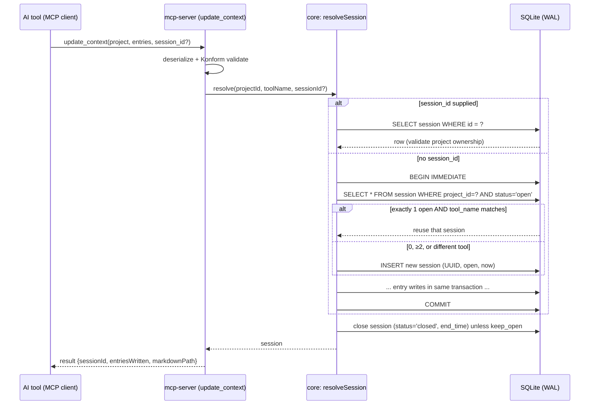
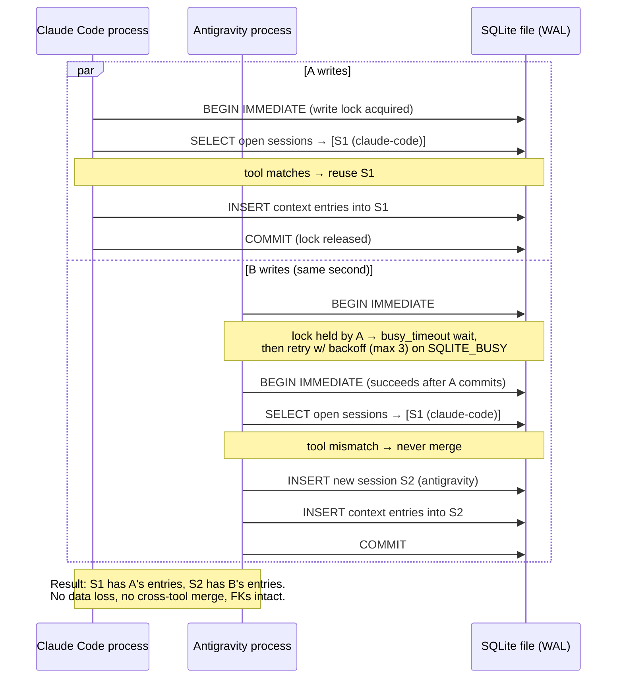

# Session Resolution & Concurrency

Deterministically answers: *"which Session row does this write belong to?"* — including when two AI tools hit the same project in the same second.

## 1. Rules

Given a write for project `P` from tool `T` (e.g. `claude-code`, `antigravity`):

1. **Explicit wins.** If the caller supplies `session_id`, validate it exists and belongs to `P` (error if not — never silently fall through), then use it. This works even on a closed session (a tool may append a late note).
2. **Reuse only your own.** If exactly one `open` session exists for `P` **and** its `tool_name == T`, reuse it.
3. **Otherwise create.** Zero open sessions, more than one open session, or a single open session belonging to a *different* tool → create a new session for `T`. Two tools' work must never silently merge into one session — that's a correctness bug, not a convenience.
4. **`update_context` closes.** After a successful `update_context`, the session it operated on is closed (`status='closed'`, `end_time=now`) unless the caller passed `keep_open=true`.

> Rule 2's tool-name condition is a user-approved refinement of the original spec ([ADR-16](02-technology-decisions.md#adr-16--session-resolution-tool_name-must-match-to-reuse-user-approved-refinement)): the original rule 2 reused the single open session unconditionally, which would let Antigravity's work land inside a session labeled Claude Code — exactly the merge rule 3 exists to prevent.

## 2. Pseudocode

Lives in `modules/core` as pure policy; the atomic execution wrapper is the `TransactionRunner` port.

```kotlin
fun resolveSession(projectId: String, toolName: String, explicitSessionId: String?): Session {
    if (explicitSessionId != null) {
        val s = sessions.findById(explicitSessionId)
            ?: fail("session $explicitSessionId not found")
        require(s.projectId == projectId) { "session belongs to a different project" }
        return s
    }

    // Atomic check-then-act: BEGIN IMMEDIATE takes the write lock up front,
    // so no second process can run this block between the SELECT and the INSERT.
    return transactionRunner.inWriteTransaction {
        val open = sessions.findOpen(projectId)                  // uses idx_session_project_status
        val mine = open.singleOrNull()?.takeIf { it.toolName == toolName }
        mine ?: sessions.create(
            Session(
                id = idGenerator.newId(),                        // UUID v4
                projectId = projectId,
                toolName = toolName,
                startTime = clock.now(),
                status = OPEN,
            ),
        )
    }
}
```

Decision table:

| Open sessions for P | tool_name match | Result |
|---|---|---|
| 0 | — | create new |
| 1 | yes | **reuse** |
| 1 | no | create new (never merge) |
| ≥2 | — | create new (never guess) |

## 3. Why this is race-safe

Three layers, each covering a different scope:

| Mechanism | Scope | What it prevents |
|---|---|---|
| WAL mode | cross-process | readers and the writer proceeding concurrently without corruption |
| `BEGIN IMMEDIATE` transaction | cross-process | two processes both passing the "exactly one open?" check and both appending to the same session — the write lock is taken *before* the SELECT, so resolve-and-create is atomic |
| JVM `Mutex` per DB file + retry-with-backoff (max 3) on `SQLITE_BUSY` | in-process / cross-process | in-process: coroutine write interleaving; cross-process: the second writer's `BEGIN IMMEDIATE` gets `SQLITE_BUSY` after `busy_timeout` (5 s) and retries with backoff before surfacing an error |

SQLite allows exactly one writer at a time even in WAL — that is not a limitation here, it's the serialization point the algorithm leans on.

## 4. Sequence diagram — session resolution flow



## 5. Sequence diagram — concurrent-write scenario

Two tools, same project, same second. Claude Code has an open session; Antigravity arrives concurrently. Expected outcome (and the Phase 5 integration-test assertion): **two session rows, both tools' entries fully persisted, nothing merged, nothing lost.**



Readers (a third tool running `hydrate_context` mid-write) are unaffected throughout: WAL readers see the last committed snapshot and never block on the writer.

## 6. Abandoned sessions

A tool that crashes without calling `update_context` leaves an open session. That is deliberate — SCP never guesses that work is finished. `scp doctor` reports open sessions older than 24 h; the human (or the tool's next `update_context` with an explicit `session_id`) closes them. Future auto-archival is a separate feature with explicit semantics, per the spec's note on compaction.
