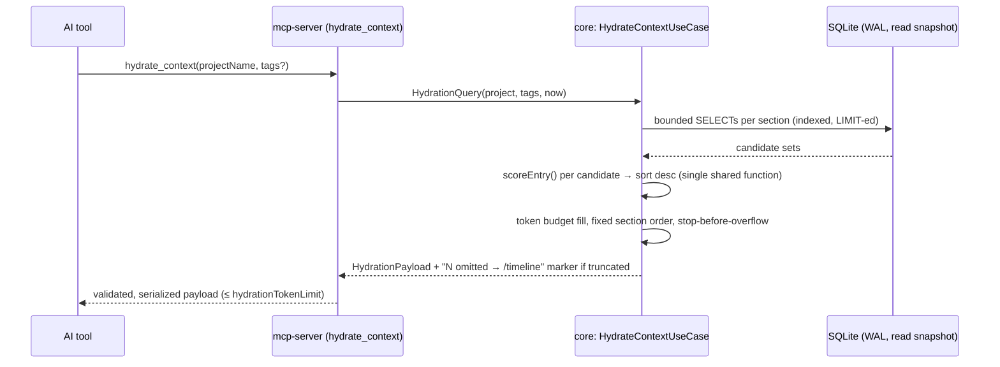

# Hydration Ranking & Token Budget

`/hydrate-context` never returns the full database. This document specifies the **single ranking mechanism** used everywhere ranking is needed (hydration and search-result ordering) and the token-budget algorithm that bounds every payload. Spec, not implementation — implemented in Phase 3 as one pure function in `modules/core`.

## 1. Scoring function

```kotlin
fun scoreEntry(entry: RankableItem, query: HydrationQuery, weights: RankingWeights): Double
```

```
score = (w1 · recencyDecay) + (w2 · priorityNorm) + (w3 · tagJaccard) + (w4 · typeWeight)
```

Every term is normalized to **[0, 1]** and the default weights sum to **1.0**, so `score ∈ [0, 1]` and scores are comparable across entity kinds and across time.

| Term | Definition | Range |
|---|---|---|
| `recencyDecay` | `2^(−ageHours / (recencyHalfLifeDays · 24))` — exponential half-life decay. Age = `now − entry.timestamp`. | (0, 1] |
| `priorityNorm` | `(priority − 1) / 4` — maps stored priority 1–5 onto 0–1 | [0, 1] |
| `tagJaccard` | `|entryTags ∩ queryTags| / |entryTags ∪ queryTags|` — Jaccard similarity, lowercase tags. **0 when the query supplies no tags/keywords** (the term simply contributes nothing; it never errors or divides by zero — an empty union is defined as similarity 0). | [0, 1] |
| `typeWeight` | per-type multiplier from config (§4), clamped to [0, 1] | [0, 1] |

Worked example (defaults, query tags `{auth, jwt}`): a 3-day-old `DECISION` entry, priority 4, tags `{auth, security}`:
`recencyDecay = 2^(−72/168) ≈ 0.743`, `priorityNorm = 0.75`, `tagJaccard = 1/3 ≈ 0.333`, `typeWeight = 1.0`
`score = 0.35·0.743 + 0.25·0.75 + 0.25·0.333 + 0.15·1.0 ≈ 0.681` (asserted by `ScoringTest`)

### Mapping non-entry entities onto the same function

Decisions and Todos lack `priority`, `tags`, and `type` columns; they map onto `RankableItem` as:

| Entity | timestamp | priority | tags | type |
|---|---|---|---|---|
| ContextEntry | own | own | own | own |
| Decision | `updated_at` | 5 (decisions are always high-value) | ∅ | `DECISION` |
| Todo | `created_at` | 4 | ∅ | `TASK` |

One function, one weight set — no second ad hoc ranking anywhere (search uses FTS5 `bm25()` only to pre-select a bounded candidate set inside SQL; presented order comes from `scoreEntry`).

## 2. Default weights

| Weight | Term | Default |
|---|---|---|
| `w1` | recencyDecay | **0.35** |
| `w2` | priorityNorm | **0.25** |
| `w3` | tagJaccard | **0.25** |
| `w4` | typeWeight | **0.15** |

Rationale: recency dominates (an AI resuming work needs the freshest state), priority and query-relevance are equal partners, and type is a tiebreaker so durable knowledge (decisions, architecture) outlives chatter of the same age.

## 3. Per-type multipliers (defaults, all 16 types)

| ContextType | Default | ContextType | Default |
|---|---|---|---|
| DECISION | 1.00 | RELEASE | 0.60 |
| ARCHITECTURE | 1.00 | COMMIT | 0.60 |
| SECURITY | 0.90 | PROMPT | 0.60 |
| BUG | 0.90 | RESEARCH | 0.50 |
| TASK | 0.80 | DOCUMENTATION | 0.50 |
| FEATURE | 0.80 | LEARNING | 0.40 |
| REFACTOR | 0.70 | TESTING | 0.60 |
| PERFORMANCE | 0.70 | MEETING | 0.30 |

## 4. Token budget enforcement

Total output is capped by `hydrationTokenLimit` (default **12000** tokens).

**Token estimation:** `estimateTokens(s) = ceil(s.length / 4)` — the standard ~4-chars-per-token heuristic. Deliberately a named function behind which a real tokenizer can be swapped later; the budget algorithm doesn't care how tokens are counted.

**Algorithm:**

```
budget = hydrationTokenLimit
omitted = 0
for section in FIXED_ORDER:                      # §5 order below
    candidates = fetch(section)                  # bounded SQL (LIMIT), score-ordered where ranked
    for item in candidates:
        cost = estimateTokens(render(item))
        if cost <= budget:  emit(item); budget -= cost
        else:               omitted += remaining_in(section); break   # stop-before-overflow
if omitted > 0:
    emit("...{omitted} more entries omitted, see full history via /timeline")
```

Truncation is **always signaled, never silent**. The project summary (section 1) is always emitted — if even it exceeds the budget it is hard-truncated with the marker, so hydration never returns an empty payload for a configured project.

## 5. Hydration payload order

1. Project summary
2. Last 5 sessions (most recent first; fewer if budget-constrained)
3. Open architecture decisions (`decision.status = 'open'`, score-ordered)
4. Open TODOs (`todo.status IN ('open','in_progress')`, score-ordered)
5. Pending/unresolved bugs (`context_entry.type = 'BUG'` in open work, score-ordered)
6. Top-N relevant prompts (`type = 'PROMPT'`, score-ordered against query tags)
7. Recently modified files (`file` ordered by `updated_at` desc)
8. Current priorities (highest-scoring open items across 3–5)



## 6. Reserved extension: semantic similarity

When embeddings land (the `context_entry.embedding` BLOB already exists), the function gains one term — `+ (w5 · semanticSimilarity)` — by adding `w5` to `RankingWeights` (default 0, so existing configs keep identical behavior) and one addend to the sum. No interface change, no call-site change, no migration.

## 7. Configuration (defaults)

These keys live in `config.yaml`, kaml-parsed into `ScpConfig` and fail-fast validated ([ADR-11](02-technology-decisions.md#adr-11--config-kaml--serializable-scpconfig-fail-fast)). Validation: all weights ≥ 0, `recencyHalfLifeDays > 0`, `hydrationTokenLimit > 0`, multipliers ∈ [0, 1].

```yaml
databasePath: storage/database/scp.db
markdownPath: storage/markdown
autoSaveIntervalSeconds: 300
hydrationTokenLimit: 12000
hydrationRankingWeights:
  recency: 0.35            # w1
  priority: 0.25           # w2
  tagOverlap: 0.25         # w3
  type: 0.15               # w4
  recencyHalfLifeDays: 7
  typeMultipliers:         # any omitted type uses the §3 default
    DECISION: 1.0
    ARCHITECTURE: 1.0
    # ... §3 table
searchLimit: 50
logLevel: INFO
secretRedactionPatterns: []   # extends (never replaces) the built-ins in docs/03 §5
```
