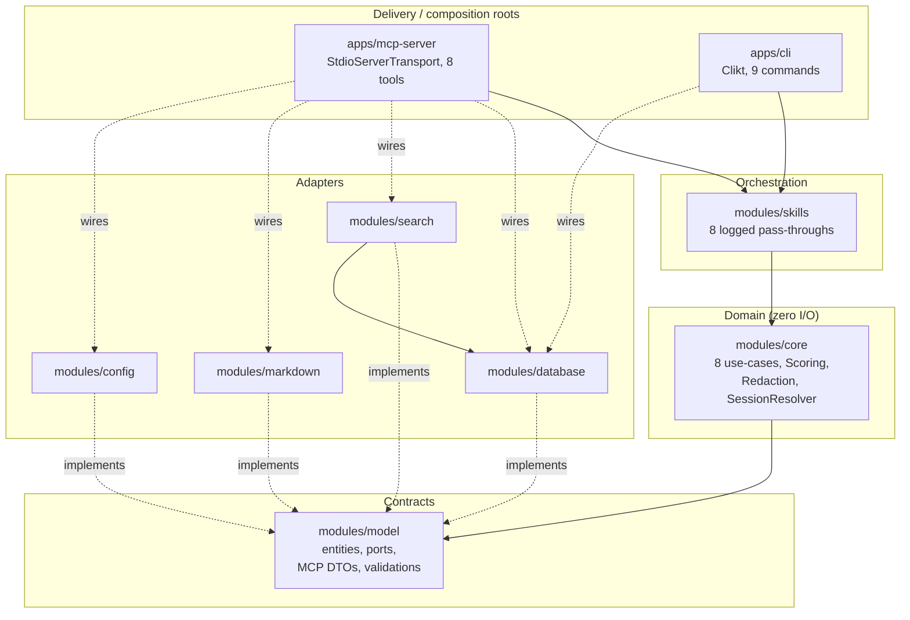
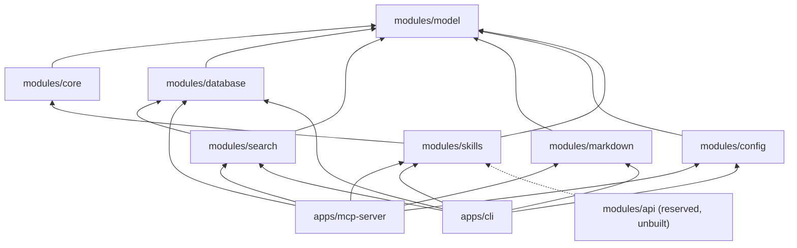
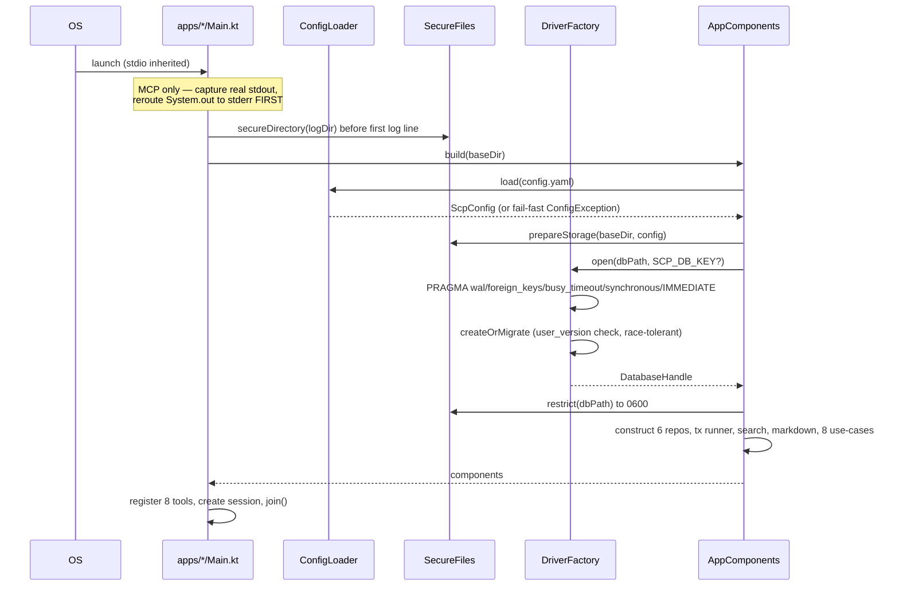
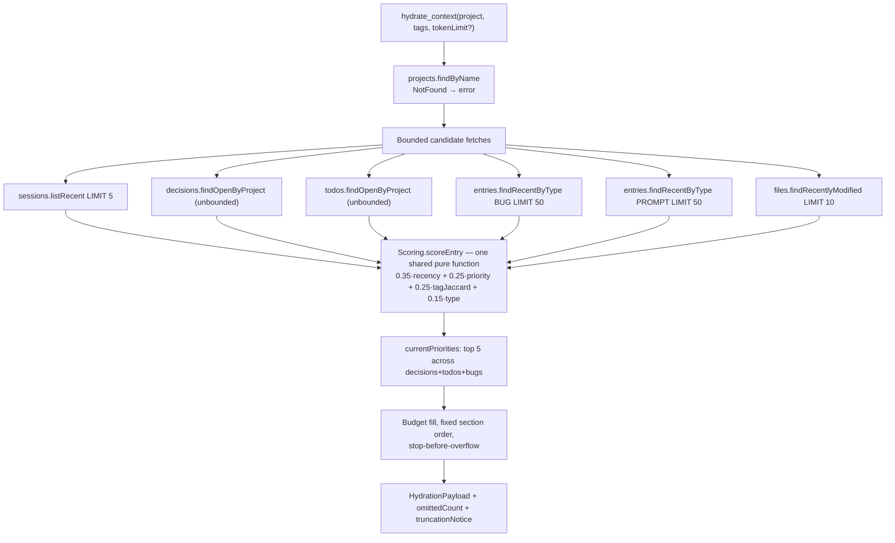

# 1. Architecture Review

Covers deliverables 2 (Architecture Review) and 5 (Data Flow Analysis) — review steps 1 and 3.

## 1.1 What SCP actually is

Stripped of framing, SCP is a **single-file SQLite database with a ranked, token-budgeted read API,
exposed over MCP stdio and a CLI**. That is not a criticism — it is the correct shape for the problem.
The value is entirely in three places: the ranking function, the session-resolution policy, and the
bounded-output discipline. Everything else is plumbing, and the plumbing is well built.

The system has no daemon, no network listener, no background thread, and no shared process. Each AI
tool launches its own `scp-mcp-server` process; coordination happens **through the database file**,
not through a running service. This is the single most consequential architectural decision in the
project, and everything in §1.5 and [13-performance-and-scalability](13-performance-and-scalability.md)
follows from it.

## 1.2 Layering

Five layers, with the boundary enforced by the Gradle module graph rather than by convention or
lint rule — `modules/core/build.gradle.kts` declares exactly one dependency, so an accidental
`import com.scp.database.*` in a use-case is a compile error, not a review comment.



| Layer | Modules | I/O? | Depends on |
|---|---|---|---|
| Delivery | `apps/mcp-server`, `apps/cli` | yes | everything |
| Orchestration | `modules/skills` | no | `core`, `model` |
| Domain | `modules/core` | **no** | `model` only |
| Contracts | `modules/model` | no | kotlinx.serialization, kotlinx.datetime, konform |
| Adapters | `database`, `search`, `markdown`, `config` | yes | `model` + their runtime libs |

This is textbook Hexagonal/Ports-and-Adapters, and it is implemented faithfully. Dependency inversion
is real: `core` names `ProjectRepository`, never `SqlProjectRepository`. Time and identity are ports
(`Clock`, `IdGenerator`), so every use-case is deterministically testable — and the tests take
advantage of it (`modules/core/src/test/kotlin/com/scp/core/FakePorts.kt`).

**F-01 (P2) — the domain is coupled to the transport contract.** `core` use-cases take MCP boundary
DTOs directly: `HydrateContextUseCase.execute(input: HydrateContextInput)`, where
`HydrateContextInput` lives in `modules/model/src/main/kotlin/com/scp/model/mcp/McpInputs.kt`. The
`mcp` package name is the tell — the pure domain layer's input type is named after the protocol
that happens to call it today. Adding an HTTP or gRPC surface means either reusing types called
`Mcp*` or writing a translation layer that should have existed from the start. `modules/model` also
pulls `konform` (a boundary-validation library) into the contracts layer for the same reason.

*Cost to fix:* small — introduce `core`-owned command types (`HydrateCommand`, `UpdateCommand`) and
map at the delivery layer. *Revises:* ADR-10. *Not urgent* — it costs nothing until a second
transport lands, which is exactly when it will be most expensive to unpick.

**F-02 (P2) — `modules/skills` is a layer with no behaviour.** All eight classes have the shape:

```kotlin
public class HydrateContext(private val useCase: HydrateContextUseCase) {
    public fun execute(input: HydrateContextInput): HydrationPayload =
        logged("hydrate_context", input.projectName) { useCase.execute(input) }
}
```

The only thing the layer contributes is the `logged { }` wrapper
(`modules/skills/src/main/kotlin/com/scp/skills/SkillLogging.kt`). That is a legitimate concern to
centralise — but it is a cross-cutting concern, not a layer. The module buys one shared logging call
at the price of 8 classes, 8 files, a Gradle module, and a second name for every operation
(`UpdateContext` the skill vs `UpdateContextUseCase` the use-case) that a reader must hold in mind.

The counter-argument is real and worth recording: the layer is where the [skills specification](08-skills-specification.md)
lands, and skills will eventually compose multiple use-cases (`resume-work` = hydrate + search +
timeline). If that is the plan, the module earns its place. If it is not, it is ceremony. Decide
explicitly rather than by default.

## 1.3 Dependency graph



The graph is acyclic, shallow (max depth 4), and has exactly one edge that needs justification:
`search → database`. The justification given in [docs/01 §2](../01-architecture.md) is correct — the
search adapter composes SQLDelight-generated typed queries rather than duplicating schema knowledge,
and `core` still only sees the `SearchIndex` port. Accept it.

One structural observation: `apps/mcp-server` and `apps/cli` have **identical** dependency lists.
That is the signature of the duplication in F-03.

**F-03 (P1) — the two composition roots are ~95% identical.**
`apps/mcp-server/src/main/kotlin/com/scp/server/AppComponents.kt` and
`apps/cli/src/main/kotlin/com/scp/cli/CliComponents.kt` contain the same ~120 lines of wiring: same
config load, same `SecureFiles.prepareStorage`, same `SCP_DB_KEY` handling, same six repositories,
same transaction runner, same encryption-implies-`NoOpMarkdownStore` rule, same eight use-case
constructions with identical argument order.

This is not stylistic. The encryption work currently in the working tree had to edit **both** files
in lockstep (`git diff --stat` shows exactly that). The next such change is where the two silently
diverge, and the divergence will be invisible: the CLI and the MCP server would simply behave
differently against the same database. For a system whose entire premise is "every client sees the
same context", two independently-maintained wiring paths is the highest-leverage defect in the
codebase that is not yet a bug.

*Fix:* extract a `modules/bootstrap` (or a `ScpRuntime.open(baseDir): ScpRuntime` factory in an
existing module) that both apps call. The composition-root pattern is preserved — there is still one
place where concretes meet interfaces, there is just one of it instead of two. *Revises:* ADR-12,
which justified manual DI on the grounds that "wiring is a plain, readable function per app". The
justification holds; the duplication is not required by it.

## 1.4 Startup and initialization lifecycle



Three things this diagram gets right and most projects get wrong:

1. **stdout is guarded before anything else runs.** `apps/mcp-server/.../Main.kt` captures
   `FileDescriptor.out` and redirects `System.out` to stderr *before* obtaining a logger, with a
   comment explaining that a top-level `val logger` would initialise too early. On a stdio transport
   a single stray `println` corrupts the protocol frame. This is the correct paranoia.
2. **Log directory permissions are set before the first log line**, so logback never creates the
   directory with default permissions.
3. **Schema creation tolerates a cross-process race.** `DriverFactory.createOrMigrate` catches the
   "already exists" failure and re-checks for the `project` table, because two agents starting
   simultaneously against a fresh database will both try to create the schema. Most codebases
   discover this in production.

**F-04 (P2) — `PRAGMA user_version` is set outside the schema-creation transaction.** In
`modules/database/.../DriverFactory.kt`, `Schema.create(driver)` and
`PRAGMA user_version = $target` are separate statements, and the code comments explain why a manual
`BEGIN`/`COMMIT` is not possible (sqlite-jdbc auto-wraps each autocommit statement). A crash between
the two leaves a fully-created schema reporting `user_version = 0`; the next startup takes the
`create` branch, hits "already exists", falls through the `hasProjectTable` guard, and re-sets
`user_version`. So it self-heals today. The hazard is future: once real `.sqm` migrations exist, the
same window means a migration can apply and then be re-applied. Worth a test before the first
migration ships, not before.

## 1.5 Write path (`update_context`)

```mermaid
sequenceDiagram
    participant T as AI tool
    participant S as McpTools.callTool
    participant K as Skill (logged)
    participant U as UpdateContextUseCase
    participant TX as SqliteTransactionRunner
    participant R as Repositories
    participant MD as FileMarkdownStore

    T->>S: update_context(JSON)
    S->>S: kotlinx.serialization (shape)
    S->>S: Konform (constraints)
    S->>K: UpdateContextInput
    K->>U: execute()
    U->>R: projects.findByName — OUTSIDE the transaction
    U->>TX: inWriteTransaction {
    TX->>TX: JVM lock (per db path) + BEGIN IMMEDIATE + retry×3 on BUSY
    U->>U: SessionResolver.resolve (explicit / reuse-own / create)
    U->>U: Redaction.redact over every title, content, summary, reason
    U->>R: insert entries, decisions, todos; upsert files
    U->>R: sessions.close unless keepOpen
    U->>R: projects.touch
    U->>R: entries.findBySession (re-read for the mirror)
    TX-->>U: } commit
    U->>MD: write() — file I/O outside the write lock
    U-->>T: UpdateContextResult {sessionId, counts, markdownPath}
```

The two most important properties are both correct:

- **Redaction happens before the first repository call**, in the use-case, so the database and the
  Markdown mirror never see a raw secret. It is a pure function over `RedactionPattern`s
  (`modules/core/src/main/kotlin/com/scp/core/Redaction.kt`), directly unit-tested.
- **Markdown I/O is outside the transaction.** The write lock is never held across file system
  latency. Deliberate, and commented as such.

**F-05 (P1) — the Markdown mirror is rewritten in full on every update.**
`UpdateContextUseCase.kt:77` re-reads `entries.findBySession(session.id)` — the session's *entire*
entry history — and `FileMarkdownStore` renders and rewrites the whole file. For a session closed in
one call this is fine. For the `keepOpen=true` workflow the docs actively recommend (an agent saving
progress incrementally), writing N entries across N calls costs O(N²) rendering and disk writes, and
the re-read happens inside the write transaction where it holds the lock against every other agent.

*Fix:* append-render, or accept the re-read but move it after the commit (it only needs a consistent
read, not the write lock).

**F-06 (P2) — the project lookup is outside the transaction that uses its id.**
`projects.findByName(input.projectName)` runs before `inWriteTransaction`, so between the lookup and
the write another process could — in principle — delete the project. Today nothing deletes projects,
so this is unreachable. Note it now because the fix (move the lookup inside) is one line, and the
day a `delete_project` tool lands it becomes a real TOCTOU.

## 1.6 Read path (`hydrate_context`)



The design is right: bound in SQL, rank with one shared function, fill a token budget in a fixed
section order, and always signal truncation. Three defects sit inside it.

**F-07 (P0) — hydration never returns most of what agents store.** `HydrateContextUseCase.kt:65,67`
fetch entries of exactly two types: `BUG` and `PROMPT`. `ContextType` has sixteen members. Entries
of type `ARCHITECTURE`, `FEATURE`, `TASK`, `LEARNING`, `REFACTOR`, `SECURITY`, `RESEARCH`,
`TESTING`, `COMMIT`, `RELEASE`, `PERFORMANCE`, `DOCUMENTATION`, `MEETING`, and `DECISION` are
accepted by `update_context`, validated, redacted, persisted, indexed for search — **and never
appear on the resume path.**

The `openDecisions` section reads the `decision` *table*, not `DECISION`-typed entries, so an agent
that records an architectural decision as a context entry (which the type enum invites, and the
`save_note` tool defaults toward) has that decision silently excluded from every future hydration.

This is the product's core promise. "Claude Code stops, Antigravity hydrates and continues" fails
for implementation progress, code understanding, and reasoning — precisely the things listed in the
project brief. The information is not lost (it is in `timeline` and `search_context`), but the
resume path does not surface it, and no agent knows to go looking.

*Fix:* add a general `entries.findRecent(projectId, limit)` section — the repository method already
exists and is currently unused by any use-case — ranked by the shared scoring function, with the
per-type multipliers in `RankingWeights.DEFAULT_TYPE_MULTIPLIERS` doing the prioritisation they were
designed for. The multiplier table already assigns weights to all sixteen types, which is strong
evidence this was the intent and the wiring was simply never completed.

**F-08 (P1) — `omittedCount` under-reports; truncation is *not* always signalled.** Design principle
7 in the README states "every read path has an explicit token ceiling; truncation is always signaled,
never silent." The `Budget` class honours this for items it drops. But items removed by the SQL
`LIMIT`s — `SESSION_COUNT = 5`, `CANDIDATE_LIMIT = 50`, `FILE_COUNT = 10`
(`HydrateContextUseCase.kt:178-181`) — and by `.take(TOP_PROMPTS)` never reach the budget and are
never counted. A project with 400 open bugs hydrates 50, ranks them, emits whatever fits, and reports
`omittedCount` for the budget drop only. The agent is told a number that is wrong by 350.

*Fix:* have the repository return a count alongside the page, or add a `candidatesDropped` field.
Cheap, and it restores a principle the project explicitly named non-negotiable.

**F-09 (P2) — dead guard in the budget loop.** `HydrateContextUseCase.kt:131`:

```kotlin
if (emitted.size < index) return@forEachIndexed // already stopped; counted below
```

Unreachable. The only path that makes `emitted.size < index` true is a skipped candidate, and the
sole skip path (`else` branch, line 138) does `omitted += …; return emitted` — it exits the function
rather than continuing the loop. Delete the line; it implies a "continue past over-budget items"
behaviour the code does not have, which is worse than no comment.

## 1.7 Search path

`SearchContextUseCase` → `SqlSearchIndex` → one generated SQL query that composes `MATCH` with every
structured filter via joins (`ContextEntryFts.sq`). The external-content FTS5 pattern (ADR-8) is the
right call and is implemented correctly, including trigger-maintained sync and a `doctor` tripwire.

User input is sanitised into FTS syntax by quoting each whitespace-separated token
(`SqlSearchIndex.kt`), so MATCH metacharacters cannot cause a parse error. Good.

**F-10 (P0) — search discards the relevance score.** `SqlSearchIndex` computes `bm25()` and carries
it to `SearchHit.ftsRank`. `SearchContextUseCase.kt:59-61` then scores every hit with
`Scoring.scoreEntry(...)` — which takes `RankableItem` (timestamp, priority, tags, type) and **has no
bm25 input at all** — and sorts by that. `ftsRank` is read from SQL, mapped into the domain object,
and never used again.

The consequence: a search for `"NullPointerException in PaymentProcessor"` ranks a two-day-old
`DECISION` about naming conventions that mentions "payment" above a three-week-old `BUG` entry that
is a verbatim match, because recency (0.35) plus type multiplier (1.0 for DECISION vs 0.9 for BUG)
outweighs a textual relevance term that contributes zero. FTS5 is doing the work and the ranking
throws the answer away.

The port comment even says the intent: *"Raw FTS5 bm25 rank — pre-selection order only; presented
order comes from the shared scoring function."* Pre-selection by `LIMIT` on `ORDER BY fts_rank` is a
sound design **when the final ranking includes a relevance term**. It does not.

*Fix:* add a `relevance` weight to `RankingWeights` — the class already has the extension pattern
(`semantic` defaults to 0.0 for exactly this reason) — normalise bm25 across the returned candidate
set, and include it in `scoreEntry` for search callers. *Revises:* [docs/05 §1](../05-hydration-ranking.md).

## 1.8 Concurrency architecture

Three mechanisms, layered, all present and all correct for what they claim:

| Mechanism | Scope | Prevents | Where |
|---|---|---|---|
| WAL journal mode | cross-process | readers blocking the writer and vice versa | `DriverFactory` PRAGMA |
| `BEGIN IMMEDIATE` | cross-process | two processes both passing "exactly one open session?" | `SQLiteConfig.TransactionMode.IMMEDIATE` |
| `ReentrantLock` per db path + 3 retries with backoff | in-process + cross | thread interleaving; transient `SQLITE_BUSY` | `SqliteTransactionRunner` |

The integration test in `apps/cli/src/test/kotlin/com/scp/cli/ConcurrentUpdateIntegrationTest.kt` is
the real thing: two independently-built composition roots, separate connections, same file, same
instant, latch-synchronised. It asserts two session rows, ten entries, FTS consistency, and two
Markdown mirrors. There is also a read-during-write test asserting the reader sees a consistent
committed snapshot. Most projects claiming concurrency safety cannot show this.

**F-11 (P1) — session resolution degrades to "always create" with three or more agents.**
`SessionResolver.kt:38-39`:

```kotlin
val open = sessions.findOpenByProject(projectId)
val reusable = open.singleOrNull()?.takeIf { it.toolName == toolName }
```

`singleOrNull()` returns `null` when the list has two or more elements. So once *any* two agents hold
open sessions, no agent can reuse its own session — including the agent that already owns one. Every
subsequent `save_note` from Claude Code creates a brand-new session row while Claude Code's existing
open session sits there.

ADR-16's rule is "reuse only your own session" and the rationale is "never merge two tools' work".
Both are right. The implementation is stricter than the rule: it says "reuse your own session only if
nobody else has one open". With five agents, session count grows linearly with note count, hydration's
`listRecent(5)` fills with fragments, and `doctor` reports a growing pile of stale open sessions.

*Fix:* `open.filter { it.toolName == toolName }.singleOrNull()` — select your own sessions first,
then apply the single-session rule within them. This preserves ADR-16 exactly (never merge across
tools, never guess between two of your own) and makes it hold at N agents instead of two. Add a
regression test with three concurrent tools; the existing test uses two, which is precisely the
boundary where the bug does not show.

**F-12 (P2) — retry sleeps while holding the JVM lock.** `SqliteTransactionRunner` calls
`Thread.sleep(BACKOFF_MS[…])` inside `lock.withLock { }`, so a busy retry blocks every other writer
thread in this JVM, not just the retrying one. Backoffs are 50/150/400 ms and cross-process contention
already waits out a 5 s `busy_timeout` first, so the practical impact today is nil. It matters if the
MCP server ever serves concurrent tool calls in one process.

## 1.9 What the architecture gets right

Worth stating plainly, because the findings above are the exceptions rather than the rule:

- Boundaries enforced by the build, not by discipline.
- A single ranking function used by every path that ranks — no ad-hoc second sort (except the one in
  F-10, which is the exception that proves the rule was intended).
- Redaction on the write path, so the invariant "no secret at rest" is structurally guaranteed rather
  than remembered at each call site.
- Explicit API mode on every module, so nothing leaks into the public surface accidentally.
- Sixteen ADRs with rationale, consequences, *and revisit triggers* — including one (ADR-2) that
  honestly records a measurement past its own threshold rather than quietly moving the threshold.
- Deliberate non-features: no session archival because it was underspecified; no auto-close of
  abandoned sessions because "SCP never guesses that work is finished".

Continue to [module analysis](03-module-analysis.md) for the per-module breakdown, or
[memory architecture](04-memory-architecture.md) for how this shape compares to other memory systems.
