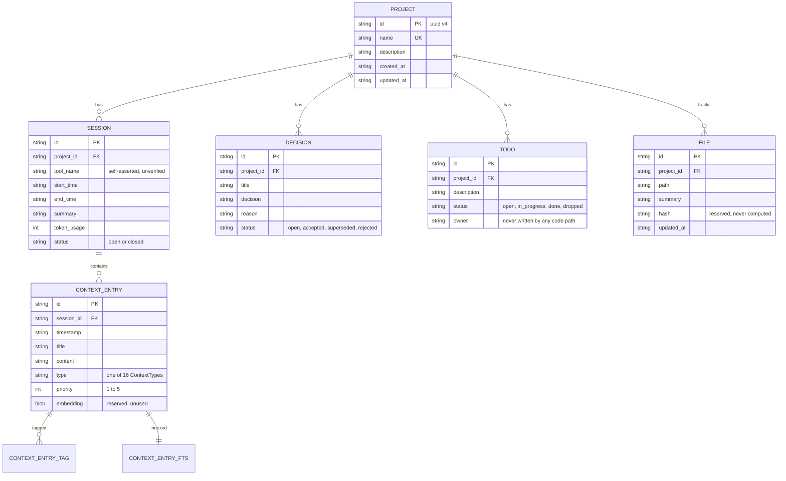
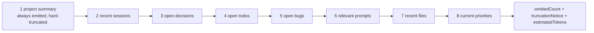

# 4. Memory Architecture

Deliverable 6 — review steps 2 and 5. What problem SCP solves, how it stores and retrieves memory,
and how that compares with the other systems in this space.

## 4.1 The problem SCP exists to solve

Every AI coding agent has the same two failure modes, and they are different problems that get
confused with each other:

1. **Intra-session amnesia** — the context window fills up and early reasoning is lost. Solved by
   summarisation, compaction, and retrieval; every agent vendor works on this.
2. **Inter-session, inter-agent amnesia** — the session ends, or the human switches from Claude Code
   to Cursor, and *everything* is gone. The next agent starts from zero: re-reads the repo,
   re-derives the architecture, re-asks the questions, and re-makes decisions that were already made
   and already rejected.

Problem 2 is the one SCP targets, and it is genuinely under-served. Vendor memory features solve it
*within one vendor* — Claude's memory helps Claude, Cursor's helps Cursor. The moment work crosses
tools, the human becomes the transport layer: copy-pasting summaries, re-explaining constraints,
re-litigating decisions. SCP's premise is that the context should outlive both the session and the
agent, and should live on the developer's disk rather than in any vendor's account.

**The insight that makes it work:** MCP already standardises how *any* agent talks to *any* local
tool. So a memory layer only needs to be an MCP server to be universal — it inherits Claude Code,
Cursor, Antigravity, Gemini CLI, Codex, Continue.dev, and everything built after, for free. SCP does
not compete with MCP; it is a citizen of it. That framing is correct and it is the project's
strongest idea.

## 4.2 Memory taxonomy — what SCP actually stores

The brief asks about ten memory kinds. Here is which ones SCP has, in its own terms:

| Memory kind | In SCP | Mechanism | Notes |
|---|---|---|---|
| **Session** | ✅ | `session` table + `context_entry` rows keyed to it | One row per tool per work period; `tool_name` records who |
| **Project** | ✅ | `project` table + all child entities scoped by `project_id` | The primary scope. Everything belongs to exactly one project |
| **Repository** | ⚠️ partial | `file` table (path, summary, hash) | Tracks *what the agent said about* files; does not read the repo, has no git awareness |
| **Long-term** | ✅ | Nothing expires; SQLite is the durable store | Effectively "everything is long-term" — there is no decay, only recency *ranking* |
| **Short-term** | ❌ | — | No scratchpad, no working-set. An entry is either persisted forever or not written |
| **Persistent** | ✅ | Single-file SQLite + Markdown mirror | Survives process, session, machine reboot |
| **Temporary** | ❌ | — | No TTL, no ephemeral scope |
| **Agent-specific** | ⚠️ weak | `session.tool_name`, `todo.owner` | Recorded as a *label*, never used to scope reads or enforce anything |
| **Shared** | ✅ | Everything is shared by default | The default and only mode; see §4.6 for why that is a security decision too |
| **Workspace** | ⚠️ | The `storage/` directory + `-Dscp.home` | Workspace = a directory. Multiple projects per workspace; no cross-workspace concept |
| **Global** | ❌ | — | No cross-project memory. A lesson learned in project A is invisible in project B |

Two observations.

**The taxonomy is flatter than the vision implies.** SCP has essentially one memory tier — durable,
project-scoped, shared — with recency ranking standing in for decay. That is a defensible design (it
is simple, and simple survives), but it means concepts like "short-term working memory" or "global
lessons" have nowhere to live. An agent wanting to note "I am currently mid-refactor of module X" must
write it as a permanent `TASK` entry that will still be there in six months, and F-24 means it can
never be marked done.

**Agent identity is decorative.** `tool_name` is a self-asserted string on the write path. It scopes
session *resolution* (ADR-16) and appears in search results, but it never scopes reads, never gates
writes, and is never verified. See [12-security-assessment](12-security-assessment.md) §Identity.

### The entity model



**F-30 (P1) — the model has no edges.** Every entity hangs off `project` or `session`; nothing relates
to anything else. There is no way to express:

- this decision *supersedes* that one (the `SUPERSEDED` status exists with no pointer to the successor)
- this bug *was fixed by* that commit entry
- this todo *implements* that decision
- this entry *is a correction of* that earlier, wrong entry
- these three entries are *about* the same subsystem (tags approximate this, flatly)

For a system whose value is "the next agent understands the reasoning", the absence of relationships
means reasoning is stored as prose in `content` and can only be recovered by reading it. This is the
single biggest structural difference from graph-based memory systems (§4.7) and the highest-value
schema addition available: one `entry_relation(from_id, to_id, kind)` table would be additive, cheap,
and would make `SUPERSEDED` mean something.

## 4.3 Write flow

```mermaid
sequenceDiagram
    participant A as Agent
    participant V as Validation (serialization + Konform)
    participant U as UpdateContextUseCase
    participant R as Redaction (pure)
    participant TX as Write transaction
    participant FTS as FTS5 triggers
    participant MD as Markdown mirror

    A->>V: update_context{project, tool, entries[], decisions[], todos[], files[], summary}
    V->>V: reject on shape or constraint violation
    V->>U: validated DTO
    U->>U: resolve project by name (NotFound → error)
    U->>TX: BEGIN IMMEDIATE (JVM lock + retry×3)
    U->>U: SessionResolver: explicit id / reuse own / create new
    U->>R: redact every title, content, summary, reason, file summary
    R-->>U: redacted entities
    U->>TX: INSERT entries (+tags), decisions, todos; UPSERT files
    TX->>FTS: AFTER INSERT trigger → index updated in the same transaction
    U->>TX: close session unless keepOpen; touch project.updated_at
    TX-->>U: COMMIT
    U->>MD: render + atomic write (outside the lock)
    U-->>A: {sessionId, counts, markdownPath}
```

The invariants this flow guarantees, all of them real:

- **No secret at rest.** Redaction is before the first repository call, so it cannot be forgotten per
  call site.
- **Index can never drift.** FTS maintenance is in-transaction triggers, not application code.
- **All-or-nothing.** Entries, decisions, todos, files, session close, and project touch commit
  together.
- **Cross-tool merge is impossible.** `BEGIN IMMEDIATE` makes resolve-then-insert atomic across
  processes, so two agents can never both decide to append to the same session.
- **The write lock is never held across file I/O.**

**What the write flow does not do:** it cannot update or delete anything (F-24). "Write flow" is
literally the complete set of state transitions in the system.

## 4.4 Read flow

Three read paths with sharply different characters, which is the right design — one bounded default,
one targeted, one unbounded escape hatch:

| Path | Bounded? | Ranked? | Purpose |
|---|---|---|---|
| `hydrate_context` | yes — token budget + SQL limits | yes | Resume: the default entry point for a new agent |
| `search_context` | yes — `limit`, max 500 | yes (but see F-10) | Targeted lookup |
| `timeline` | **no** | no, chronological | Escape hatch for anything hydration omitted |
| `project_summary` | partially — 20 decisions / 50 todos / 5 sessions | no | Orientation and statistics |

### Hydration ranking

One function, four normalised terms, used by every ranking path:

```
score = 0.35·2^(−ageHours/halfLifeHours)   recency, 7-day half-life
      + 0.25·(priority−1)/4                 stored priority 1–5
      + 0.25·jaccard(entryTags, queryTags)  tag overlap
      + 0.15·typeMultiplier[type]           DECISION 1.0 … MEETING 0.3
      + 0.00·semanticSimilarity             reserved for embeddings
```

Every term is normalised to [0,1] and the default weights sum to 1.0, so scores are comparable across
entity kinds — decisions, todos, and bug entries are ranked against each other on one scale to
produce the `currentPriorities` section. That comparability is a deliberate and well-executed design
choice; most systems rank within a type and then interleave arbitrarily.

The exponential half-life decay is the right function (linear decay makes old items worthless too
fast; no decay makes stale items compete forever), and the half-life is configurable.

**Where it falls short:** no relevance term at all. Tag Jaccard is the only query-dependent input, and
it requires the caller to supply tags that exactly match stored tags. There is no term for "this entry
mentions what I asked about" — which is exactly F-10's finding in the search path, and the same gap in
hydration: `hydrate_context` cannot be asked "hydrate me about the payment module" except through tags
that someone remembered to apply.

### Token budget

Fixed section order, stop-before-overflow, per [docs/05](../05-hydration-ranking.md) §4:



Sections are filled in order until the budget runs out. Section 1 is guaranteed by hard truncation
rather than omission. Token counting is `TokenEstimator`, a swappable interface with a ~4-chars-per-
token default — correctly abstracted, since the budget algorithm should not care how tokens are
counted.

**Structural consequence of fixed order:** later sections starve. With a tight budget and many open
decisions, `currentPriorities` — arguably the single most useful section for an agent resuming work —
is the first thing to vanish, because it is section 8. A proportional allocation (reserve a share per
section, then redistribute the unused remainder) would be more robust, and would cost one pass over
the sections.

Combined with F-07 (only BUG and PROMPT entries are ever fetched) and F-08 (`omittedCount` misses
SQL-limit drops), the read path currently under-delivers against its own specification.

## 4.5 Update, synchronization, and conflict resolution

**Update flow.** Does not exist (F-24). Entities are insert-only; the enum values and repository
methods for state transitions are present and unreachable.

**Synchronization.** Between processes on one machine: the SQLite file, WAL, and `BEGIN IMMEDIATE`.
This is real synchronisation and it is correct. Across machines: nothing, by design — the roadmap
reserves UUID v4 PKs and UTC timestamps precisely so a future sync protocol needs no ID migration,
which is genuine foresight.

**Conflict resolution.** SCP's answer is *conflict avoidance*: sessions are per-tool and never
merged, so two agents writing simultaneously produce two disjoint session rows rather than a
conflict. Within a session, entries are append-only, so there is nothing to conflict over.

This works precisely because nothing is ever updated. The moment F-24 is fixed and two agents can
both set `todo.status`, SCP has a real conflict problem and no mechanism for it — no version column,
no `updated_at` on todos, no optimistic concurrency check, no last-writer-wins policy statement.

**Recommendation:** add an `updated_at` and a monotonically increasing `version` to any entity that
becomes mutable, and make status updates compare-and-set (`WHERE id = ? AND version = ?`). Doing this
*with* the F-24 fix costs almost nothing; doing it afterwards is a migration.

**Context merging.** There is none, and this is deliberate — [docs/04](../04-session-resolution.md)
states "SCP never guesses that work is finished" and ADR-16 states silently merging two tools' work is
a correctness bug. Agreed. But "no merging" also means no deduplication: if Claude Code and
Antigravity both record "chose SQLDelight over Room", SCP stores two decisions and hydration shows
both. At 5+ agents, the resume payload fills with near-duplicates. Deduplication is a genuinely hard
problem and shipping without it is right; it belongs on the roadmap as an explicit item, not as an
unstated gap.

## 4.6 Everything is shared by default

There is no scoping mechanism of any kind. Every project in the database is visible to every process
that can open the file; there is no private-to-agent memory, no per-project access control, and no
way for an agent to record something without publishing it to all future agents.

For the intended deployment — one developer, one machine, agents the developer launched — this is the
right default and the simplicity is a feature. It becomes a design question the moment any of these
is true: multiple developers share a workspace, an agent processes untrusted input (a public repo
issue, a dependency's README, a web page), or SCP gains a network transport. See
[12-security-assessment](12-security-assessment.md).

## 4.7 Comparison with the memory landscape

The systems in the brief occupy different points on four axes. Placing SCP against them is more
useful than a feature checklist.

| Axis | SCP's position |
|---|---|
| **Locality** | Fully local, zero network. The strongest position on this axis of anything listed |
| **Retrieval** | Keyword (FTS5/bm25) + heuristic ranking. No embeddings, no vectors, no graph traversal |
| **Structure** | Typed and relational, no edges. More structured than blob memory, less than a graph |
| **Scope** | Cross-agent by construction. The distinguishing property |

| System | What it is | How SCP differs |
|---|---|---|
| **Model Context Protocol** | The transport/capability standard, not a memory system | Not a competitor — SCP is an MCP server. MCP defines *how* an agent reaches a tool; SCP is *what* it reaches. The framing in the project brief is correct |
| **Mem0** | Managed/self-hostable memory layer, typically embeddings + vector store, with extraction of salient facts from conversations | Mem0 decides *what is worth remembering* automatically; SCP requires the agent to say so explicitly via `update_context`. Mem0 leans semantic retrieval; SCP is keyword + recency. SCP is offline and file-owned; Mem0's common deployment is service-shaped |
| **OpenMemory / local memory MCP servers** | Local-first memory exposed over MCP — the closest architectural sibling | Same premise. SCP differentiates on *domain modelling*: sessions, decisions, todos, tracked files, and a 16-member type taxonomy, versus generic memories. That structure is what makes a resume payload possible instead of a similarity search |
| **LangGraph memory** | Checkpointing and store APIs inside an agent framework — thread-scoped short-term plus cross-thread long-term | Framework-coupled: your agent must be a LangGraph graph. SCP is framework-agnostic by being a protocol server. LangGraph checkpoints *execution state* and can resume a graph mid-run; SCP stores *knowledge* and cannot resume execution |
| **Graph / knowledge-graph memory** | Entities and relations, traversal and multi-hop reasoning | The sharpest contrast, and where F-30 bites. SCP has entities and no relations. Its `ContextType` taxonomy is a flat classification, not an ontology. Adding an `entry_relation` table would put SCP on this spectrum without adopting a graph database |
| **Claude memory / Cursor memory** | Vendor-integrated, zero-setup, invisible, excellent within one tool | The exact gap SCP exists to fill. These are vertical (deep in one tool); SCP is horizontal (shallow across all of them). They are complements, not substitutes, and SCP should say so explicitly rather than positioning against them |
| **"Agent memory" as a category** | Usually: episodic + semantic + procedural | SCP is almost entirely *episodic* (what happened, in sessions) with a thin semantic layer (decisions, file summaries) and no procedural memory (how to do things here) at all. `PROMPT` entries gesture at procedural memory; nothing consumes them structurally |
| **Session memory** | Within-conversation continuity | SCP's `session` is a *record* of a work period, not a live conversation buffer. It is written at the end, not maintained during. `keepOpen` is the closest thing to live session memory, and F-05 makes it expensive |
| **Repository memory** | Understanding derived from the codebase itself | SCP's `file` table stores agent-authored summaries, not derived understanding. It never reads the repo, has no git integration, and cannot tell you a summary is stale — `file.hash` exists for exactly this and nothing computes or compares it |
| **Persistent memory** | Survives restarts | Fully solved, plus a human-readable mirror, which most systems do not offer |
| **Context-window management** | Fitting things into the window | Directly addressed and well: an explicit token budget on every read path with signalled truncation. This discipline is more rigorous than most memory systems, which return N results and let the agent overflow |

### Where SCP is genuinely differentiated

1. **Cross-agent by construction, not by integration.** Being an MCP server means universality is
   inherited rather than built per-client.
2. **Domain-modelled rather than generic.** Sessions, decisions, todos, files, and typed entries let
   the system produce a *structured resume payload* — "here are the open decisions, here is what is
   in flight" — which a similarity search over undifferentiated memories cannot.
3. **Bounded output as a first-class principle.** Every read path has a token ceiling and signals
   truncation. Rare and correct.
4. **Fully offline with a human-readable mirror.** No account, no key, no egress; and the Markdown
   mirror means the data outlives the tool.
5. **Concurrency-safe multi-process access to one file.** Demonstrated by a real test, not asserted.

### Where it is behind

1. **No semantic retrieval.** Exact-token matching only. An agent asking about "auth" misses entries
   about "login" and "credentials". The `embedding` column and `semantic` weight are reserved, and
   local embedding inference is now cheap enough that this is a matter of scheduling.
2. **No relationships** (F-30).
3. **No automatic capture.** Everything requires an explicit `update_context` call, which means it
   works only when the agent remembers — the failure mode being *silence*, which nothing detects.
   [10-hook-specification](10-hook-specification.md) addresses this directly and is the highest-value
   forward design in this review.
4. **No lifecycle** (F-24). Competing memory systems at least let you delete.
5. **No summarisation or compaction.** Everything accumulates at full fidelity forever. The roadmap
   defers this deliberately and honestly, which is defensible for v1 and unsustainable at year two.

## 4.8 Assessment

The memory *architecture* is sound and the retrieval discipline is better than most of the field. The
memory *model* is one table-shape away (relations) and one lifecycle-fix away (F-24) from being
genuinely complete for its stated purpose, and neither is a redesign — both are additive.

The thing to protect while fixing them: SCP's advantage is not sophistication, it is that it is local,
structured, bounded, and universal. Every proposed addition should be tested against those four.

Next: [multi-agent collaboration](05-multi-agent-collaboration.md).
