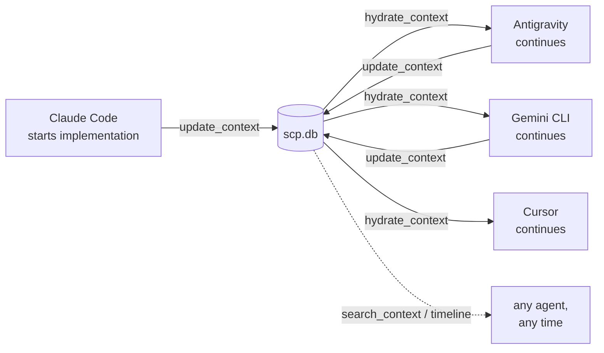
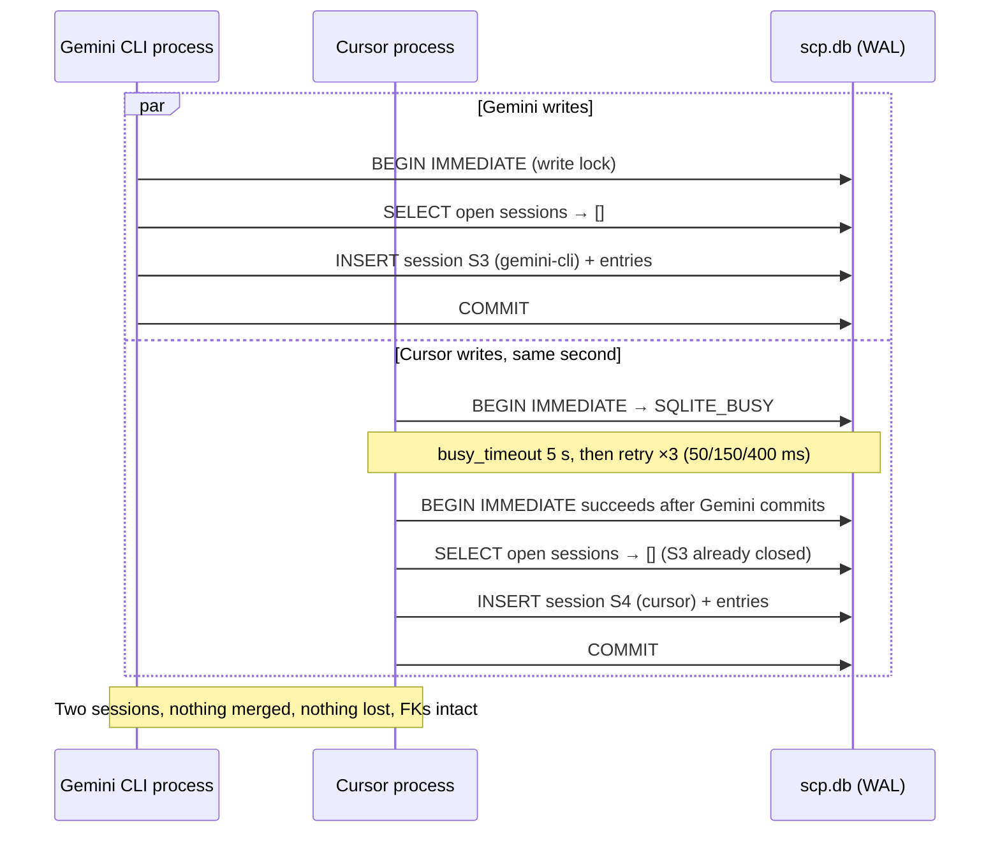

# 5. Multi-Agent Collaboration Analysis

Deliverable 7 — review step 6. The complete handoff workflow, traced through the actual code, with
the gaps that show up when you do.

## 5.1 The intended workflow



No agent talks to another agent. Every handoff is mediated by the file. That is the right topology —
it means agents need to know nothing about each other, agree on no schedule, and can arrive months
apart. It also means every coordination property must be provided by the store, which is where §5.4
finds the gaps.

## 5.2 The handoff, traced through real calls

### Act 1 — Claude Code works and saves

The developer starts a payments refactor. Claude Code works for two hours, then calls:

```json
{
  "name": "update_context",
  "arguments": {
    "projectName": "payments-service",
    "toolName": "claude-code",
    "summary": "Extracted PaymentProcessor into a port + two adapters; Stripe adapter done, PayPal adapter stubbed.",
    "entries": [
      { "title": "Port/adapter split for PaymentProcessor", "type": "ARCHITECTURE", "priority": 5,
        "tags": ["payments", "refactor"],
        "content": "PaymentProcessor is now an interface in domain/. StripeAdapter implements it fully. PayPalAdapter throws NotImplementedError — see todo." },
      { "title": "Stripe webhook signature check fails on replay", "type": "BUG", "priority": 4,
        "tags": ["payments", "stripe"],
        "content": "Replayed webhooks pass signature validation because the timestamp window is unbounded." }
    ],
    "decisions": [
      { "title": "Adapter per PSP, not a switch statement", "decision": "One adapter class per payment service provider.",
        "reason": "PSPs differ in retry/idempotency semantics; a switch would leak those differences into the domain." }
    ],
    "todos": [
      { "description": "Implement PayPalAdapter.capture()", "owner": "unassigned" },
      { "description": "Bound the Stripe webhook timestamp window to 5 minutes" }
    ],
    "files": [
      { "path": "domain/PaymentProcessor.kt", "summary": "New port. Do not add PSP-specific fields." },
      { "path": "adapters/StripeAdapter.kt", "summary": "Complete. Webhook verification has the replay bug." }
    ]
  }
}
```

What the code does with this, in order (`UpdateContextUseCase`):

1. Resolves `payments-service` by name. **Fails with `NotFoundException` if `create_project` was
   never called** — there is no auto-create. Friction worth noting: the first thing a new agent does
   is often the thing that errors.
2. Opens `BEGIN IMMEDIATE`, takes the write lock.
3. `SessionResolver.resolve(projectId, "claude-code", null)` → no open sessions → creates session
   `S1`, `tool_name = "claude-code"`, `status = open`.
4. Redacts every string. If the entry content had contained `sk-ant-…`, it is `[REDACTED:anthropic-key]`
   before any repository sees it.
5. Inserts 2 entries (+4 tag rows), 1 decision, 2 todos, 2 file rows. FTS triggers index the entries
   in the same transaction.
6. `keepOpen` is absent → false → closes `S1` with the summary and `end_time`.
7. Commits. Writes `storage/markdown/payments-service/2026-08-05-a3f9c1d2.md` outside the lock.
8. Returns `{sessionId: "a3f9c1d2-…", sessionWasCreated: true, sessionClosed: true, entriesWritten: 2, …}`.

**This half works exactly as advertised.** Atomic, redacted, indexed, mirrored, and safe against a
concurrent writer.

### Act 2 — Antigravity resumes the next morning

```json
{ "name": "hydrate_context", "arguments": { "projectName": "payments-service", "tags": ["payments"] } }
```

What comes back, per `HydrateContextUseCase`:

| Section | Contents | Correct? |
|---|---|---|
| `projectSummary` | The `project.description` set at creation | ⚠️ stale — never updated (F-24) |
| `recentSessions` | `S1`: claude-code, times, and the two-line summary | ✅ |
| `openDecisions` | "Adapter per PSP, not a switch statement" + reason | ✅ **the strongest part** |
| `openTodos` | Both todos | ✅ |
| `openBugs` | The Stripe replay `BUG` entry | ✅ |
| `relevantPrompts` | empty | ✅ (none stored) |
| `recentFiles` | Both file summaries | ✅ |
| `currentPriorities` | Top 5 scored across decisions/todos/bugs | ✅ |
| **The `ARCHITECTURE` entry** | **absent** | ❌ **F-07** |

Antigravity learns the decision and the reason, the open work, the bug, and which files matter. That
is a real, useful handoff — substantially better than nothing, and better than a summary paste.

But the `ARCHITECTURE` entry explaining that `PaymentProcessor` is now a port, that `StripeAdapter` is
complete, and that `PayPalAdapter` throws — **the implementation progress** — is not in the payload.
It was stored, validated, redacted, persisted, and indexed. `hydrate_context` fetches only `BUG` and
`PROMPT` typed entries (`HydrateContextUseCase.kt:65,67`), so it is invisible on the resume path.

Antigravity can recover it — `search_context("PaymentProcessor")` or `timeline` would return it — but
**nothing in the payload tells it to look**. `omittedCount` counts budget drops, not type-filtered
entries, so the truncation notice does not fire either (F-08). The agent has no signal that it is
missing anything.

This is the gap between "SCP works" and "SCP delivers its promise". The promise is *context,
architecture decisions, implementation progress, reasoning, code understanding*. Decisions and todos
arrive. Implementation progress and reasoning — the parts agents record as typed entries — do not.

### Act 3 — Antigravity works and saves

Antigravity fixes the webhook bug and calls `update_context` with `toolName: "antigravity"`.
`SessionResolver` finds zero open sessions (S1 was closed), creates `S2`. Clean.

Two friction points appear here that the developer will feel:

- The webhook todo cannot be marked done (**F-24**). Antigravity's only option is a new entry saying
  "fixed the webhook window", while the todo "Bound the Stripe webhook timestamp window" stays open
  forever, in every future hydration, for every future agent.
- Nothing links the fix to the bug entry or to the todo (**F-30**). The relationship exists only as
  prose.

### Act 4 — Gemini CLI, a week later

`hydrate_context` now returns two sessions, one decision, **still both todos** (one of them done a
week ago), one bug entry (still listed as open — no mechanism marks it fixed), plus a new entry from
Antigravity if it happened to be `BUG`-typed.

By the third handoff, the payload is measurably degrading:

- Open todos that are done accumulate monotonically.
- Bug entries never close, because `BUG` is a `ContextType` and types have no status.
- Decisions never move past `OPEN`, so a superseded decision presents identically to a current one —
  the failure mode that actively misleads rather than merely omitting.

**The resume payload's signal-to-noise ratio decreases with every handoff**, which inverts the
product's value proposition. The system is most useful at handoff 1 and least useful at handoff N,
when it should be the reverse.

### Act 5 — Cursor, concurrent with Gemini

Now two agents work simultaneously. This is where §5.4's coordination gaps become visible rather than
theoretical.

## 5.3 What concurrency actually guarantees



This is verified by `apps/cli/src/test/kotlin/com/scp/cli/ConcurrentUpdateIntegrationTest.kt` — two
independently-built stacks, separate connections, latch-synchronised, asserting two session rows, all
ten entries, FTS consistency, and two Markdown mirrors. Plus a second test proving a reader hydrating
mid-write sees a consistent committed snapshot.

**These guarantees are real and they are the project's strongest engineering.** Write serialisation,
no lost updates, no cross-tool merge, no index drift, readers never blocked.

**What they are not:** collaboration. Every guarantee above is about *not corrupting data when agents
write at the same time*. None is about *agents working together*.

## 5.4 The coordination gaps

### F-31 (P0) — nothing prevents duplicated work

Gemini and Cursor both hydrate, both see the todo "Implement PayPalAdapter.capture()", both start
implementing it. SCP has no mechanism to prevent, detect, or even notice this.

There is no claim, no lease, no lock, no assignment, no "in progress by X". `Todo.status` has an
`IN_PROGRESS` value that nothing can set (F-24) and `Todo.owner` is a nullable string that nothing
ever writes — `NewTodo.owner` is accepted at the boundary and defaults to `null`, and no code path
sets it afterwards.

For a *multi-agent* protocol, work claiming is not an advanced feature; it is the minimum viable
coordination primitive. Without it, N agents on one project do N times the work and produce N
conflicting implementations, and SCP's contribution is to have faithfully recorded all of them.

*Fix (P1, small):* `claim_work(todoId, agentId, ttlSeconds)` → compare-and-set `status = in_progress`
and `owner = agentId` with an expiry, plus `release_work`. The columns exist; the `CHECK` constraint
already permits `in_progress`; it needs a use-case, a tool, and a lease-expiry sweep in `doctor`.

### F-32 (P1) — no agent can be notified of anything

MCP supports server→client notifications, and the server declares
`ServerCapabilities.Tools(listChanged = false)` and nothing else
(`apps/mcp-server/src/main/kotlin/com/scp/server/Main.kt`). There is no subscription mechanism, so an
agent cannot learn that another agent changed something. Every agent's view is a snapshot from
whenever it last hydrated.

Concretely: Cursor hydrates at 09:00 and works until 11:00. Gemini rewrites the module at 09:30 and
records a decision reversing the port/adapter split. Cursor never finds out and spends 90 minutes
building on a decision that was reversed. SCP has all the information and no way to push it.

*Fix:* see [06-mcp-compatibility](06-mcp-compatibility.md) §Notifications — a `resources/updated`
notification on the project resource is the standard-conformant answer, and it only works if the
server is long-lived, which for MCP stdio it is.

### F-33 (P1) — sessions fragment under three or more agents

`SessionResolver.kt:39` uses `open.singleOrNull()`, so once any two agents hold open sessions, no
agent can reuse its own. See [01-architecture-review](01-architecture-review.md) F-11 for the analysis
and the one-line fix.

Practical effect in a five-agent workflow with `save_note` (which always resolves without an explicit
id): every note creates a session. `hydrate_context` shows `listRecent(5)` — five one-note fragments
— instead of five meaningful work periods. The `recentSessions` section becomes useless exactly when
multi-agent activity makes it most valuable.

### F-34 (P2) — abandoned sessions are only reported, never resolved

A crashed agent leaves an open session forever. `doctor` warns about open sessions older than 24 h,
and [docs/04 §6](../04-session-resolution.md) argues deliberately that SCP should never guess work is
finished. **That reasoning is correct and should be preserved.**

But "never auto-close" and "provide no way to close" are different positions, and the system currently
takes the second. There is no `close_session` tool and no `scp close-session` command. The documented
remedy — "the tool's next `update_context` with an explicit `session_id`" — requires the *crashed*
agent to come back and do it. A human who wants to clean up has no interface.

*Fix:* `close_session(sessionId, summary?)` as an explicit, human-or-agent-invoked operation. Keeps
the no-guessing principle intact and makes the state reachable.

### F-35 (P2) — agent identity is unverified and unusable

`toolName` is a free string supplied by the caller. Nothing verifies it, so any agent can write as
`"claude-code"`. And nothing *uses* it beyond session resolution and display — reads are never scoped
by it, and there is no per-agent view, no "what did Antigravity do", no attribution query.

The label is simultaneously untrustworthy and under-exploited. See
[12-security-assessment](12-security-assessment.md) §Identity for the trust half.

### F-36 (P2) — no handoff protocol

The workflow relies entirely on convention: an agent *should* call `hydrate_context` when it starts
and `update_context` when it stops. Nothing enforces, prompts, or verifies either.

- If an agent forgets to hydrate, it works blind — and SCP has no way to know it should have.
- If an agent forgets to update, two hours of work vanishes — and the failure is *silence*, the
  hardest failure mode to notice.

This is the strongest argument for [10-hook-specification](10-hook-specification.md): the handoff
protocol should be automatic, driven by client lifecycle events, not by an agent remembering. It is
also the strongest argument for MCP prompts ([09](09-mcp-prompt-library.md)) — a `resume-work` prompt
the client surfaces at session start makes hydration the path of least resistance instead of an act
of discipline.

## 5.5 Scorecard: does the handoff deliver?

Against the properties named in the project brief:

| Promise | Delivered? | Why |
|---|---|---|
| context | ⚠️ partial | Decisions/todos/files yes; typed entries missing from hydration (F-07) |
| architecture decisions | ✅ | The `decision` table is the best-served path end to end |
| implementation progress | ❌ | Recorded as entries, never hydrated (F-07); todos can't close (F-24) |
| todos | ⚠️ | Captured and surfaced, never completable (F-24) |
| reasoning | ⚠️ | `decision.reason` is excellent; entry-level reasoning is not hydrated (F-07) |
| code understanding | ⚠️ | `file.summary` works; staleness undetectable (`hash` unused) |
| project memory | ✅ | Durable, mirrored, searchable |
| session history | ✅ | `timeline` is complete and correct |
| task execution state | ❌ | No status transitions, no claims, no in-progress (F-24, F-31) |
| no manual copy-paste | ✅ | The mechanism genuinely removes this |
| no re-explaining | ⚠️ | Much less; the missing 14 entry types are what still needs re-explaining |
| no rebuilding context | ⚠️ | Same |

**Overall: the handoff works, and it delivers roughly half of what it promises.** The half it delivers
— decisions with reasons, open work, file map, session history, all bounded and ranked — is real and
already better than the copy-paste status quo. The half it does not is concentrated in two fixable
defects (F-07, F-24) and one missing primitive (F-31).

None of these is architectural. The storage model, the concurrency model, and the ranking model are
all sound and all support the missing pieces without redesign. That is the encouraging conclusion of
this section: SCP is roughly a week of focused work from delivering its full stated promise for the
sequential-handoff case, and a further increment — claiming and notifications — from the concurrent
case.

Next: [MCP compatibility report](06-mcp-compatibility.md).
