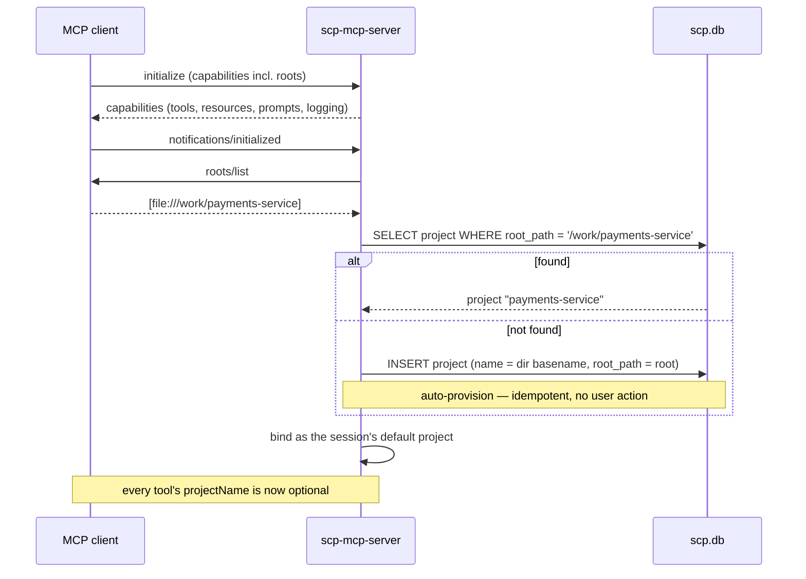
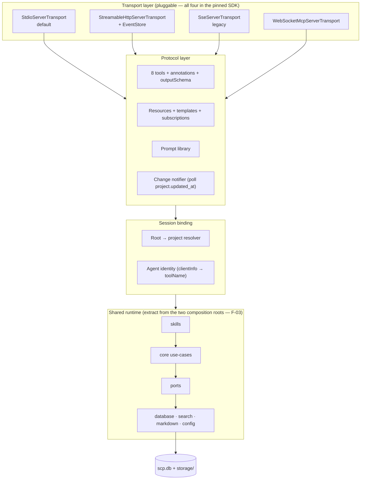
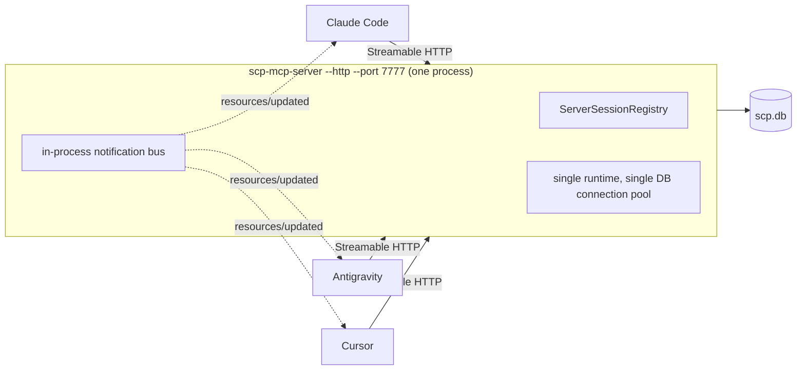
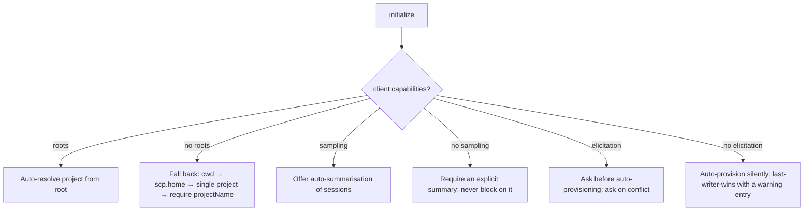
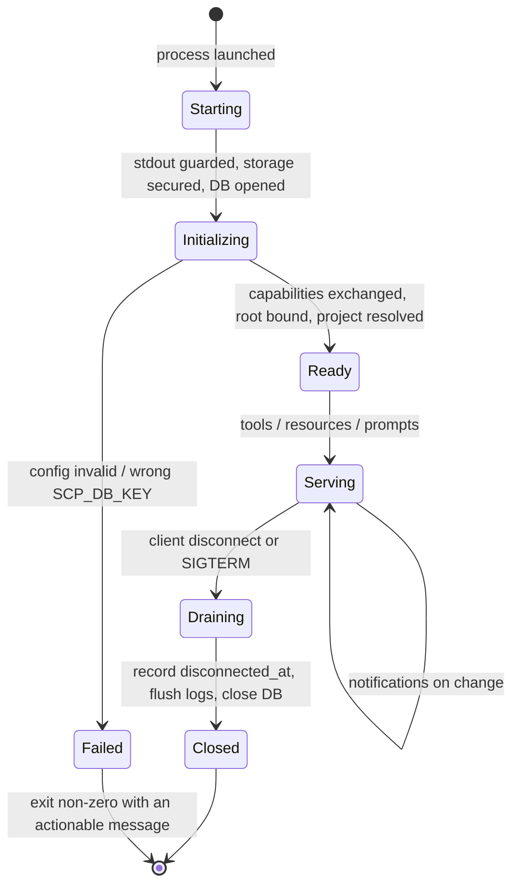

# 7. MCP Integration Blueprint

Deliverable 9 — review step 8. The design goal: **any MCP-enabled client connects once and
immediately has shared memory.** "Immediately" is the hard word — it rules out per-project setup, and
it is where the current design falls short.

## 7.1 The connect-once target

What a user should have to do, in full:

```json
{ "mcpServers": { "scp": { "command": "scp-mcp-server" } } }
```

No project name, no `create_project`, no workspace flag. From that point the agent hydrates on
session start and saves on session end, and the user never thinks about SCP again.

What is required today, by contrast: register the server **and** set the working directory or
`-Dscp.home`, **and** call `create_project` before the first write, **and** pass `projectName` on
every single call, **and** rely on the agent choosing to call `hydrate_context` at all.

Four gaps sit between the two. Each has a specific, additive fix.

| Gap | Fix | Detail |
|---|---|---|
| Workspace must be configured out-of-band | MCP **roots** | §7.2 |
| Project must be created explicitly | Auto-provision from root | §7.2 |
| `projectName` required on every call | Default from the resolved root | §7.2 |
| Hydration depends on agent discipline | **Prompts** + **hooks** | [09](09-mcp-prompt-library.md), [10](10-hook-specification.md) |

## 7.2 Zero-configuration project resolution



Three additive changes:

1. **Schema:** `ALTER TABLE project ADD COLUMN root_path TEXT` with a unique index. First real `.sqm`
   migration — good, it exercises the migration machinery that ADR-5 built and nothing has used.
2. **Resolution order:** explicit `projectName` → root match → single-project-in-workspace → error.
   Explicit always wins, so nothing existing breaks.
3. **Auto-provision:** create on first contact using the directory basename. `create_project` remains
   for explicit naming and descriptions.

Roots also fix a correctness problem that has nothing to do with convenience: today the same
repository can be written into two SCP projects because two clients passed different name strings, and
nothing detects it. Root-keyed identity makes that structurally impossible.

**Fallback when the client does not send roots** (not all do): working directory → `-Dscp.home` →
single project → require `projectName`. Degrades to today's behaviour, never worse.

## 7.3 Server architecture



The only structural change is the **session-binding layer** — root resolution and agent identity —
which is new, thin, and sits between protocol and runtime. Everything else is the existing design plus
the unused SDK surface from [06](06-mcp-compatibility.md).

Note the dependency: this design assumes **one** runtime factory, which means fixing F-03 first. With
two composition roots, every capability added here must be added twice.

## 7.4 Transports

The pinned SDK ships all four. Choosing between them is a deployment decision, not a code decision.

| Transport | When | Trade-off |
|---|---|---|
| **stdio** | Default, and correct for v1 | One process per client; no cross-process notifications; no auth needed (process isolation *is* the boundary) |
| **Streamable HTTP** | One shared server, many clients, one machine | Enables real notifications and shared state; **requires auth, origin validation, and localhost binding** |
| **SSE** | Legacy clients only | Superseded by Streamable HTTP; support only if a target client requires it |
| **WebSocket** | Bidirectional, low-latency | Fewest clients support it; no advantage over Streamable HTTP for this workload |

### Recommendation: keep stdio as the default, add Streamable HTTP as opt-in

ADR-9's reasoning for stdio-only holds: no daemon, no ports, no lifecycle service, and it is how MCP
clients invoke local servers. Do not change the default.

But stdio has a hard ceiling that matters for this product specifically: **one process per client
means no process can observe another's writes**, so notifications degrade to polling (F-32) and every
client pays JVM cold start. A shared-server mode solves both:



What this buys: real-time cross-agent notifications (no polling), JVM cold start paid once, one
connection instead of N, and a single place to enforce identity. The SDK provides
`ServerSessionRegistry`, `SessionContext`, and `TransportManager` for exactly this.

What it costs: a lifecycle to manage (start, health, shutdown), and a genuine security boundary where
none existed. Which brings us to §7.5.

### HTTP hardening — non-negotiable if HTTP ships

The pinned SDK includes `DnsRebindingProtectionConfig` and `HostValidationKt` because these are known
attack paths against local MCP servers. If `--http` ships without all five of the following, it is a
regression against the project's privacy-first premise:

1. **Bind `127.0.0.1` only.** Never `0.0.0.0`. Not configurable to a non-loopback address.
2. **Validate `Origin`** on every request — this is what stops a web page in the user's browser from
   reaching a localhost server.
3. **Enable DNS-rebinding protection** via the SDK's config.
4. **Require a bearer token**, generated at startup, written to a `0600` file the client config reads.
5. **Reject requests over a size cap** — `RequestBodyTooLargeException` exists in the SDK for this.

## 7.5 Authentication and identity

**Under stdio, no authentication is needed and none should be added.** The trust boundary is the OS
process boundary: whoever can spawn the server already has the user's filesystem privileges and could
read `scp.db` directly. Adding auth here is theatre.

**Under HTTP, authentication is mandatory**, because a local port is reachable by every process and
every browser tab on the machine. Bearer token, as above.

Separately from authentication is **identity**, which matters under both transports:

**F-42 (P1) — agent identity is self-asserted and derivable but not derived.** `toolName` is a free
string on every write. Any caller can write as `"claude-code"`. Meanwhile MCP's `initialize` handshake
carries `clientInfo` (name and version) which the client supplies about itself — not cryptographic,
but *structurally more trustworthy* than a per-call string, because it is established once at
connection time rather than per request.

*Recommendation:*

- Default `toolName` from `clientInfo.name` at session bind. Keep the explicit parameter as an
  override for CLI and scripting.
- Record both on the session: `tool_name` (asserted) and `client_info` (negotiated).
- Be honest in the docs that neither is authenticated. Under stdio that is fine and provable; under
  HTTP the bearer token is the actual identity and `clientInfo` is a label.

## 7.6 Capability negotiation and degradation

Clients differ. The server must work when a capability is absent, and this is where most MCP servers
break in practice.



**The rule: every capability-dependent behaviour has a defined no-capability path, and the no-capability
path is never an error.** A client without roots must still work exactly as SCP works today.

A `scp doctor --mcp` mode that reports what the connected client negotiated would make these
degradations visible instead of mysterious.

## 7.7 Lifecycle



The current implementation covers Starting → Ready → Serving → Closed correctly. Two additions:

**Draining.** `session.onClose` currently logs and completes a `Job`. It should also record
`disconnected_at` on any SCP session still open for this client, so `doctor` can distinguish "the
agent crashed" from "the agent is still running" (F-41). It must **not** auto-close the SCP session —
[docs/04 §6](../04-session-resolution.md)'s refusal to guess that work is finished is correct and
should be preserved.

**Failed.** `ConfigException` and `StorageException` already produce actionable messages
(`DriverFactory.asStorageFailure` distinguishes wrong-key from not-encrypted, which is genuinely good
error design). Under MCP these must reach the client as a protocol error before the transport is
established, not as a silent exit — a client that sees the process die with no message reports
"server failed to start" and the user has no idea the passphrase was wrong.

## 7.8 Error handling

Three tiers, and SCP has the shape right already — the gap is granularity.

| Tier | Example | Current | Target |
|---|---|---|---|
| Protocol | malformed JSON-RPC | SDK handles | unchanged |
| Tool-level | project not found, invalid priority | `isError` + text | `isError` + text **+ structured `_meta`** |
| Fatal | wrong DB key, corrupt config | exception at startup | protocol error before transport, non-zero exit |

**F-43 (P2) — errors are unstructured prose.** `checkValid` joins all Konform violations into one
string (`"Invalid input: entries[0].priority: must be at most 5; entries[2].title: …"`) and it arrives
as `TextContent`. A model can parse that; a client cannot act on it programmatically, and an agent
retrying cannot tell "you sent a bad field" from "the project does not exist" without string matching.

*Recommendation:* keep the human-readable text (models read it) and add a machine-readable payload in
`CallToolResult._meta` — `{code, field, constraint}`. `WithMeta` is on `CallToolResult` in the pinned
SDK. Suggested codes: `PROJECT_NOT_FOUND`, `SESSION_NOT_FOUND`, `SESSION_WRONG_PROJECT`,
`VALIDATION_FAILED`, `PROJECT_EXISTS`, `STORAGE_LOCKED`, `STORAGE_KEY_INVALID`.

`STORAGE_LOCKED` deserves special mention: after `busy_timeout` plus three retries, the caller gets a
raw SQLite message. It should get a distinct, retryable code — it is the one error that is genuinely
transient, and an agent that knows it is transient can simply try again.

## 7.9 The SCP MCP client

Step 8 asks for a client design. **Recommendation: do not build a general-purpose MCP client.** SCP is
a server; every AI tool already ships a client. Building another is scope that serves no user.

Two narrower things *are* worth building:

**A test client** (`apps/mcp-test-client`, test-scope only). `kotlin-sdk-client` connects over stdio,
runs the real handshake, lists tools/resources/prompts, and asserts against schemas. This closes the
largest test gap in the project — `apps/mcp-server` has 509 lines and zero tests
([03](03-module-analysis.md)) — by testing the protocol surface the way a client actually sees it.
Highest-value testing work available.

**A relay/aggregator** (`scp-mcp-relay`, speculative). SCP sits in front of other MCP servers,
observes the tool calls flowing through, and records them as context automatically — solving F-36
(agents forgetting to save) without any agent cooperation.

This is architecturally interesting and should be treated with caution. A relay sees every tool call
from every server, which means it sees credentials, file contents, and API payloads. It becomes the
highest-value target on the machine and the single point of failure for every integration. If it is
ever built it needs its own threat model, its own opt-in, and a strict allowlist of what it records.
Note it as a possible future; do not put it on the near roadmap.

## 7.10 Implementation sequence

Ordered so each step is independently shippable and each unblocks the next:

| Step | Work | Unblocks |
|---|---|---|
| 0 | Extract the shared runtime (F-03) | Everything — otherwise all of it is done twice |
| 1 | Tool annotations + `structuredContent` + `outputSchema` | Client trust, parseable results |
| 2 | Test client + protocol tests | Safe iteration on everything after |
| 3 | Resources + templates for projects/hydration/decisions/todos/mirrors | User-pinnable context |
| 4 | Roots → project auto-resolution + auto-provision + `root_path` migration | **Connect-once** |
| 5 | Prompts ([09](09-mcp-prompt-library.md)) | Handoff as affordance, not discipline |
| 6 | Subscriptions + polled change notification | Concurrent-agent awareness |
| 7 | Structured error `_meta` | Programmatic client handling |
| 8 | Streamable HTTP + hardening (opt-in) | Shared-server mode, real notifications |
| 9 | Elicitation, sampling, completions | Polish |

Steps 0–5 deliver the "connect once, immediately gain shared memory" goal. Steps 6–9 are the
multi-agent and ergonomics layer.

Next: [skills specification](08-skills-specification.md).
